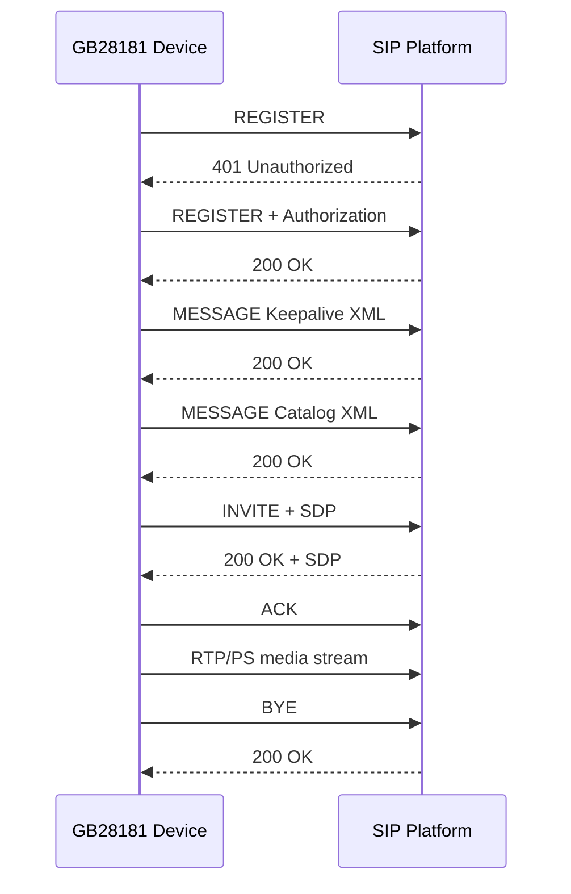
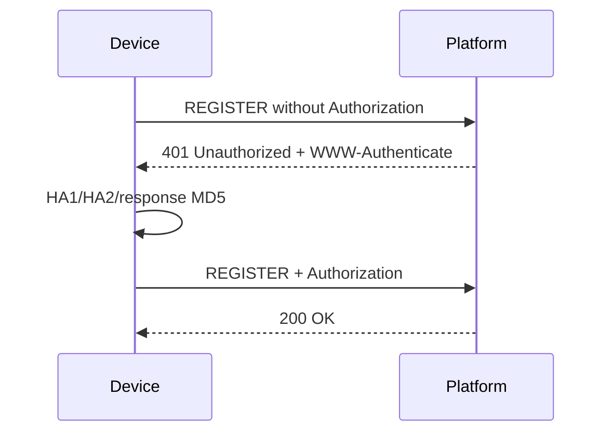
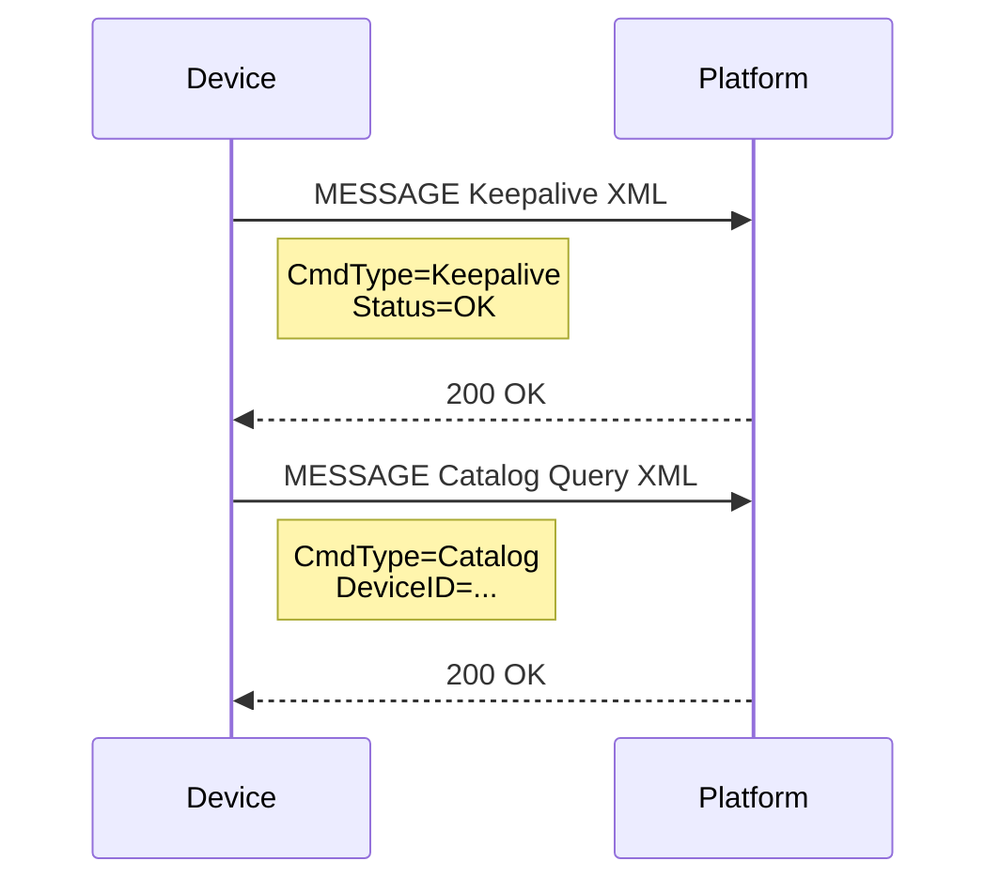
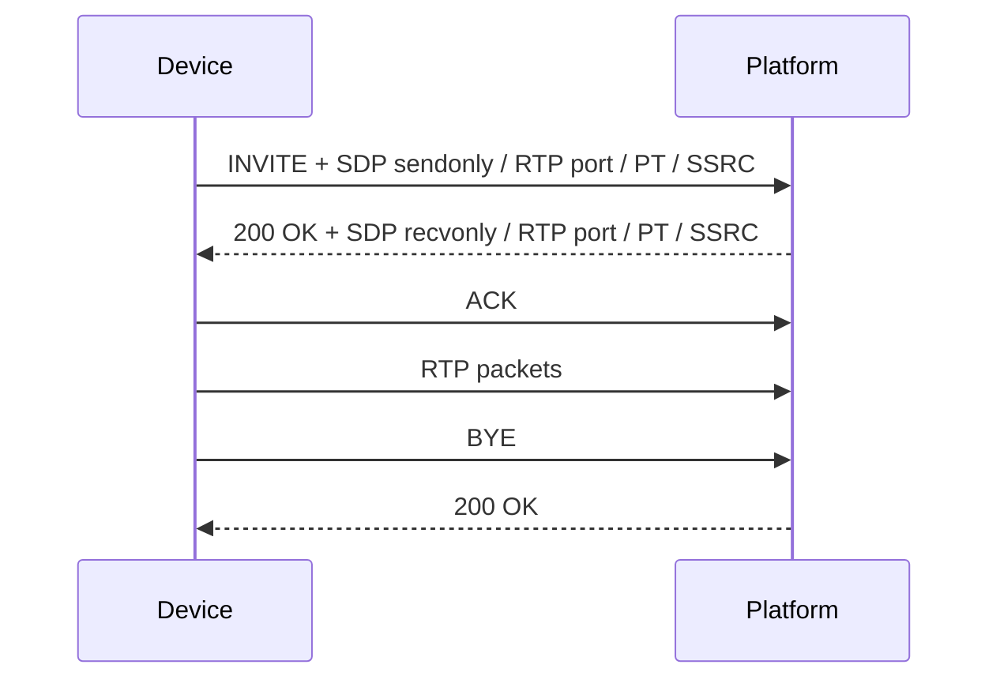
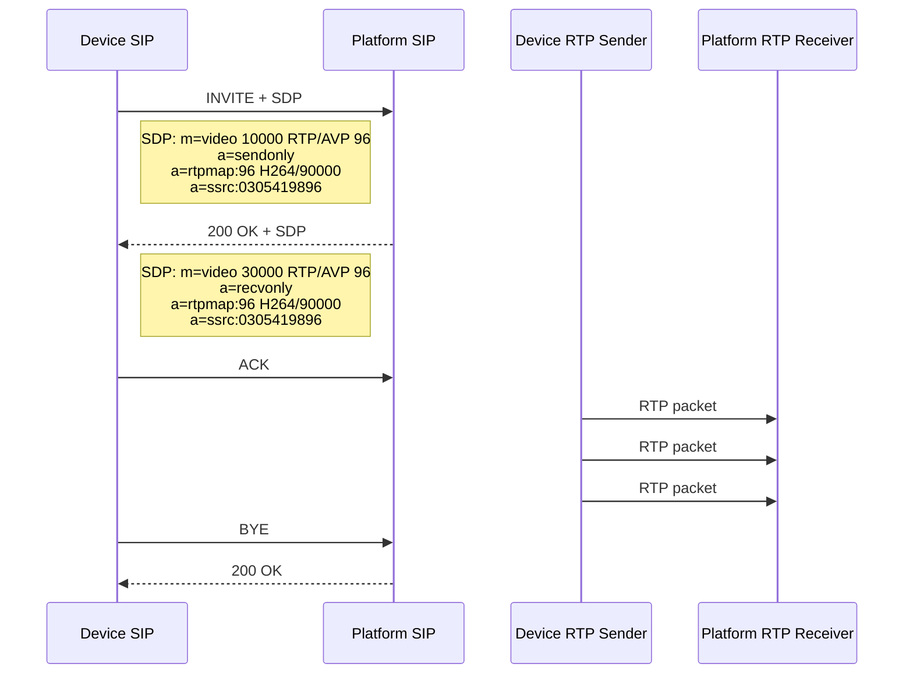
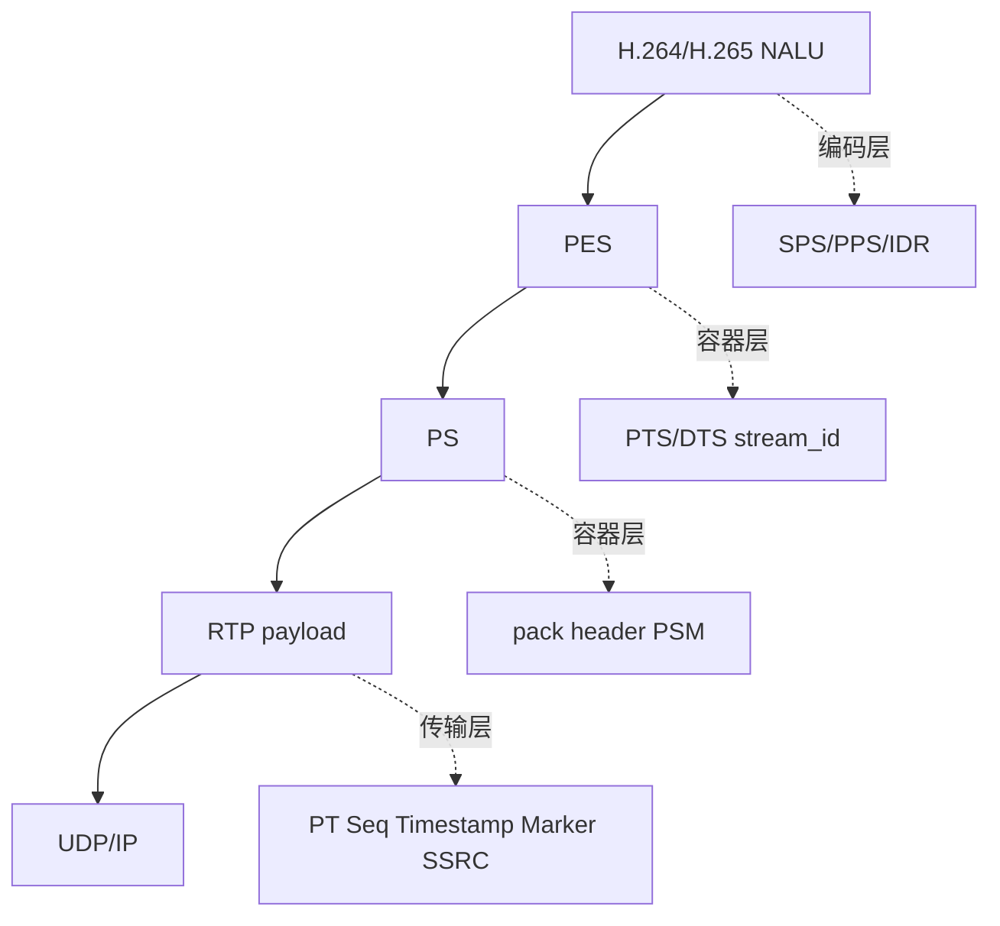
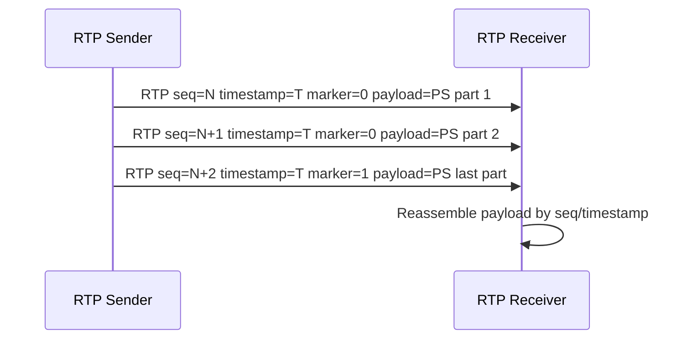

# GB28181 学习总纲

GB28181 不是容器格式，也不是单纯的 RTP 协议实现。它是一套国标监控联网协议，核心任务是把“设备、平台、会话、媒体流”组织起来。

```text
GB28181 = SIP 信令 + SDP 协商 + RTP/RTCP 承载
```

和其他层的关系可以这样拆：

```text
编码层: H.264 / H.265 / AAC
容器层: PS / TS / FLV / MP4
协议层: SIP / SDP / RTP / RTCP / GB28181
传输层: UDP / TCP / TLS
```

## 1. 为什么要分层

分层的目的不是概念化，而是为了把职责拆开：

- 编解码层负责“内容是什么”，例如一个 H.264 NALU 是 SPS、PPS 还是 IDR。
- 容器层负责“文件里怎么装”，例如 PS、TS、FLV、MP4 如何组织音视频数据。
- 协议层负责“怎么协商、怎么传、怎么维护会话”，例如 SIP 建会话、SDP 描述媒体、RTP 传负载、RTCP 反馈统计。

GB28181 的重点不在“包里是什么编码帧”，而在“会话怎么建立、媒体参数怎么协商、媒体流怎么按约定送达”。

一个很重要的边界是：`REGISTER / MESSAGE / INVITE / ACK / BYE` 都属于 SIP 信令面；`SDP` 是信令 body 里的媒体描述；`RTP/RTCP` 才是媒体面。学习时不要把 XML 控制消息、SDP 描述文本、RTP payload 混成同一层。

## 2. GB28181 管什么

GB28181 主要回答这些问题：

1. 设备怎么注册到平台。
2. 平台怎么查询设备目录和状态。
3. 平台怎么发起实时预览或回放。
4. 媒体流的 IP、端口、编码类型、payload type、SSRC 怎么协商。
5. RTP 媒体包怎么发给平台。
6. 会话如何结束、如何 BYE。

最小流程可以先理解成：

```text
REGISTER
  -> 平台 200 OK 或 401 Unauthorized
  -> 如果是 401，设备用 Digest 鉴权后重新 REGISTER

MESSAGE
  -> Keepalive / Catalog / DeviceInfo / DeviceStatus
  -> MESSAGE 本身是 SIP 方法，具体命令放在 XML body 里

其中 `Keepalive` 的意思就是“设备还在线”，`Catalog` 的意思就是“查目录/查通道”。

INVITE + SDP
  -> 协商媒体地址、端口、payload type、SSRC、编码名
  -> 平台 200 OK

RTP
  -> 发送 H.264 / H.265 / AAC payload

BYE
  -> 结束会话
```

完整最小交互图可以这样看：



这张图是 GB28181 最小闭环的总览。它把三件事串起来：先注册，再发业务控制消息，再建媒体会话，最后结束会话。

按顺序拆开看：

| 阶段 | 含义 |
|---|---|
| `REGISTER` | 设备先向平台表明自己在线 |
| `401 Unauthorized` | 平台要求设备做 Digest 鉴权 |
| `REGISTER + Authorization` | 设备带鉴权信息重发注册 |
| `MESSAGE Keepalive` | 设备上报保活，证明在线 |
| `MESSAGE Catalog` | 设备或平台发起目录查询 |
| `INVITE + SDP` | 设备发起媒体会话协商 |
| `200 OK + SDP` | 平台同意会话并给出媒体参数 |
| `ACK` | 设备确认会话建立 |
| `RTP/PS media stream` | 真正的音视频开始走 RTP |
| `BYE` | 设备结束会话 |
| `200 OK` | 平台确认结束 |

这张图的关键不是记住每个字，而是记住顺序：**先注册，再保活/查询，再协商媒体，再发 RTP，最后结束**。

## 3. SIP 是什么

SIP 是 GB28181 的事务和会话控制语言。它负责“谁和谁说话、说什么、什么时候结束”，但不直接承载音视频字节。

常见 SIP 方法：

| 方法 | 作用 |
|---|---|
| `REGISTER` | 设备注册到平台 |
| `INVITE` | 发起媒体会话，通常携带 SDP |
| `ACK` | 确认 INVITE |
| `BYE` | 结束会话 |
| `MESSAGE` | Keepalive、Catalog、DeviceInfo 等 XML 消息常用 |

常见 SIP 头字段：

| 字段 | 作用 |
|---|---|
| `Via` | 请求经过的路径和本端地址 |
| `From` / `To` | 会话两端标识，通常携带 tag |
| `Call-ID` | 同一事务/对话的标识 |
| `CSeq` | 请求序号和方法名 |
| `Contact` | 后续联系本端的地址 |
| `Content-Type` | body 类型，SDP 常见为 `application/sdp` |
| `Content-Length` | body 长度 |

响应最常见的是：

```text
SIP/2.0 200 OK
SIP/2.0 401 Unauthorized
```

学习时先抓这几个字段：`status_code`、`Call-ID`、`CSeq`、`From`、`To`、`Contact`、`Content-Length`、`body`。它们决定一条 SIP 事务是不是成功、是否需要鉴权、后续媒体协商是否成立。

### 3.1 Digest 鉴权

`401 Unauthorized` 之后，平台通常会要求 Digest 鉴权。设备要用 `WWW-Authenticate` 里的 `realm`、`nonce` 等信息重新计算响应值，再发第二次 `REGISTER` 或 `INVITE`。

这个闭环可以理解成：

```text
第一次 REGISTER / INVITE
  -> 401 Unauthorized
  -> 响应头里带 WWW-Authenticate: Digest realm=..., nonce=...
  -> 设备计算 Authorization: Digest ... response=...
  -> 再次发送 REGISTER / INVITE
```



这张图只讲 Digest 鉴权的最小闭环。它说明 `Authorization` 不是密码本身，而是设备根据平台给的 `WWW-Authenticate` challenge 计算出来的响应。

逐步理解：

| 步骤 | 含义 |
|---|---|
| `REGISTER without Authorization` | 第一次注册故意不带鉴权头，平台会拒绝 |
| `401 Unauthorized + WWW-Authenticate` | 平台下发 `realm`、`nonce`、`qop` 等挑战参数 |
| `HA1/HA2/response MD5` | 设备用用户名、密码、方法、URI 和 challenge 计算摘要 |
| `REGISTER + Authorization` | 设备把计算结果放进 Authorization 头重发 |
| `200 OK` | 平台验证通过，注册成功 |

对应到代码，就是 `gb28181_parse_www_authenticate()` 先拆 challenge，再由 `gb28181_build_digest_authorization()` 拼出 `Authorization`。

当前最小模块已经补了两块底座：

- `gb28181_parse_www_authenticate()`：解析 `realm` / `nonce` / `qop` / `opaque` / `algorithm`
- `gb28181_build_digest_authorization()`：根据用户名、密码、方法、URI 和 challenge 计算 `Authorization` 头

现在又补了一个最小 UDP 收发示例：

- `gb28181_sip_register_client.cpp`：发第一次 `REGISTER`，接 401，再发带 `Authorization` 的第二次 `REGISTER`

这还不是完整 SIP 状态机，但已经足够支撑你下一步接真实 401 响应做学习验证。

### 3.2 MESSAGE、Keepalive 和 Catalog

GB28181 里很多设备控制和查询不是靠新的传输连接完成，而是走 SIP `MESSAGE`。`MESSAGE` 这层仍然是 SIP 报文，头部继续使用 `Via / From / To / Call-ID / CSeq / Content-Type / Content-Length`，真正的业务命令放在 XML body 里。

在当前学习代码里，`Keepalive` 就是在线保活消息，`Catalog` 就是目录查询消息。前者回答“设备还活着吗”，后者回答“设备有哪些通道/资源”。

`gb28181_sip_register_client.cpp` 的 `main()` 前半段就是在学这一步：先让设备在线，再做基本查询，确认控制面能跑通。

当前最小模块补了两个学习用构造函数：

- `gb28181_build_message_keepalive()`：设备保活通知。
- `gb28181_build_message_catalog()`：目录查询请求。

Keepalive 的 body 示例：

```xml
<?xml version="1.0" encoding="GB2312"?>
<Notify>
<CmdType>Keepalive</CmdType>
<SN>3</SN>
<DeviceID>34020000001320000001</DeviceID>
<Status>OK</Status>
</Notify>
```

Catalog 查询的 body 示例：

```xml
<?xml version="1.0" encoding="GB2312"?>
<Query>
<CmdType>Catalog</CmdType>
<SN>4</SN>
<DeviceID>34020000001320000001</DeviceID>
</Query>
```

Catalog 响应链路现在已经补成最小闭环了：平台会先回一个 `200 OK`，再主动发一条目录响应 MESSAGE。这个目录响应里会包含最小的 `DeviceList`、`DeviceItem`、在线状态等字段，便于学习“查询 + 响应”这条链路。

外层 SIP 报文里重点看：

| 字段 | 学习重点 |
|---|---|
| `MESSAGE sip:... SIP/2.0` | 说明这是 SIP MESSAGE 方法，不是媒体数据 |
| `CSeq: 3 MESSAGE` | 同一端发出的事务序号，便于跟响应配对 |
| `Content-Type: Application/MANSCDP+xml` | GB28181 常用 XML 控制体 |
| `Content-Length` | XML body 的字节长度 |
| XML `<CmdType>` | 真正的业务命令，例如 `Keepalive` / `Catalog` |

抓包过滤可以用：

```text
sip || udp.port == 5060 || udp.port == 5062
```

在 Wireshark 里选中 `MESSAGE` 报文后，看两层内容：先看 SIP header 确认事务，再展开 message body 看 XML 的 `<CmdType>`、`<SN>`、`<DeviceID>`。这里没有 RTP，也没有 PS/PES/NALU，因为它是控制面消息。

MESSAGE 的最小交互图：



这张图讲的是 MESSAGE 控制消息，不是媒体流。它的重点在 XML body，而不是 SIP 头本身。

理解时抓两层：

| 层 | 看什么 |
|---|---|
| SIP 外层 | `Via`、`From`、`To`、`Call-ID`、`CSeq`、`Content-Type`、`Content-Length` |
| XML 内层 | `<CmdType>`、`<SN>`、`<DeviceID>`、`<Status>` |

两类 MESSAGE 含义不同：

| MESSAGE 类型 | 作用 |
|---|---|
| Keepalive | 设备保活，上报在线状态 |
| Catalog | 查询目录或通道列表 |

在当前学习代码里，`gb28181_sip_register_client.cpp` 发这两个 MESSAGE，`gb28181_sip_mock_server.cpp` 负责把 `<CmdType>` 解析出来再回 `200 OK`。

### 3.3 Catalog 查询与响应

Catalog 是 GB28181 里最常见的查询之一，作用是“查目录/查通道”。你可以把它理解成平台在问设备：

```text
你下面有哪些通道、哪些资源、哪些设备项可以被播放或管理？
```

Catalog 这条链路现在可以这样理解：

```text
设备发 MESSAGE Catalog Query
平台先回 SIP 200 OK
平台再发一条 Catalog Response MESSAGE
设备收到后，才真正拿到目录列表
```

Catalog 的查询请求和前面的 `Keepalive` 很像，外层仍然是 SIP `MESSAGE`，真正的业务命令放在 XML body 里。不同点在于：

- `Keepalive` 用 `<Notify>`，表示设备状态上报
- `Catalog` 用 `<Query>`，表示设备主动向平台查询目录

Catalog 查询的 body 现在在代码里对应 `gb28181_build_message_catalog()`，它会构造类似下面的 XML：

```xml
<?xml version="1.0" encoding="GB2312"?>
<Query>
<CmdType>Catalog</CmdType>
<SN>4</SN>
<DeviceID>34020000001320000001</DeviceID>
</Query>
```

这里最重要的字段是：

| 字段 | 作用 |
|---|---|
| `CmdType=Catalog` | 表示这是目录查询 |
| `SN` | 查询序号，便于和响应配对 |
| `DeviceID` | 发起查询的设备编号 |

平台收到后先回一个 `200 OK`，然后再发一条 `Catalog Response MESSAGE`。这条响应里一般会带目录列表、在线状态、通道编号、通道名称等信息。学习阶段可以先把它理解成“平台把设备树/通道树回给你”。

一个最小的 Catalog 响应 body 可以长成这样：

```xml
<?xml version="1.0" encoding="GB2312"?>
<Response>
<CmdType>Catalog</CmdType>
<SN>4</SN>
<DeviceID>34020000001320000001</DeviceID>
<SumNum>2</SumNum>
<DeviceList Num="2">
<Item>
<DeviceID>34020000001320000001</DeviceID>
<Name>Camera-01</Name>
<Manufacturer>MockVendor</Manufacturer>
<Model>IPC-MOCK-01</Model>
<Owner>3402000000</Owner>
<CivilCode>340200</CivilCode>
<Address>Mock Address</Address>
<Parental>0</Parental>
<ParentID>34020000002000000001</ParentID>
<SafetyWay>0</SafetyWay>
<RegisterWay>1</RegisterWay>
<Secrecy>0</Secrecy>
<Status>ON</Status>
</Item>
<Item>
<DeviceID>34020000001320000002</DeviceID>
<Name>Camera-02</Name>
<Manufacturer>MockVendor</Manufacturer>
<Model>IPC-MOCK-02</Model>
<Owner>3402000000</Owner>
<CivilCode>340200</CivilCode>
<Address>Mock Address 2</Address>
<Parental>0</Parental>
<ParentID>34020000002000000001</ParentID>
<SafetyWay>0</SafetyWay>
<RegisterWay>1</RegisterWay>
<Secrecy>0</Secrecy>
<Status>OFF</Status>
</Item>
</DeviceList>
</Response>
```

这里可以这样读：

| 字段 | 作用 |
|---|---|
| `CmdType=Catalog` | 表示这是目录响应 |
| `SN` | 和查询请求里的 `SN` 对应 |
| `DeviceID` | 目录响应所属设备或平台编号 |
| `SumNum` | 目录总条数 |
| `DeviceList Num="1"` | 当前响应里包含 1 条目录项 |
| `Item` | 一条具体的设备/通道记录 |
| `Name` | 通道名称 |
| `Manufacturer` | 厂商 |
| `Model` | 型号 |
| `Owner` | 所属级联或平台编号 |
| `CivilCode` | 行政区划码 |
| `ParentID` | 父级节点编号 |
| `RegisterWay` | 注册方式 |
| `Status` | 在线状态，`ON` 表示在线 |

`Item` 本身就是一条目录记录，里面这些字段可以这样理解：

| 字段 | 作用 |
|---|---|
| `DeviceID` | 这一条目录项自己的编号 |
| `Name` | 通道或设备名称 |
| `Manufacturer` | 厂商 |
| `Model` | 型号 |
| `Owner` | 上级归属编号，常见于级联场景 |
| `CivilCode` | 行政区划码 |
| `Address` | 地址信息 |
| `Parental` | 是否有父子级联关系 |
| `ParentID` | 父级目录编号 |
| `SafetyWay` | 安全接入方式 |
| `RegisterWay` | 注册方式 |
| `Secrecy` | 是否保密 |
| `Status` | 当前在线状态 |

当前 mock 代码返回的是一条固定目录项，目的不是模拟完整设备树，而是让你先把“目录查询 -> 目录响应 -> 解析字段”这条链路跑通。真正工程里，这一层通常会扩展成多级树、多条通道和级联设备列表。

最小响应里一般会看到这些字段：

| 字段 | 作用 |
|---|---|
| `CmdType` | 仍然是 `Catalog`，表示目录相关消息 |
| `SN` | 用来和查询请求对上号 |
| `DeviceID` | 当前目录消息对应的设备或平台编号 |
| `SumNum` | 目录里总共有多少条记录 |
| `DeviceList` | 通道列表容器 |
| `Item` | 单个通道或设备条目 |
| `Status` | 在线/离线状态 |

如果你在 Wireshark 里看 Catalog，重点是两层：

1. SIP 头里的 `CSeq`、`Call-ID`、`Content-Type`、`Content-Length`
2. XML body 里的 `CmdType`、`SN`、`DeviceID`、`DeviceList`

也就是说，Catalog 既是一次查询，也是一次“目录结构返回”的学习样本。你后面看 `DeviceInfo` / `DeviceStatus` 时，可以把它们当成同一类 MESSAGE 查询的不同业务命令。
| `Item` | 单个通道或设备条目 |
| `Status` | 在线/离线状态 |

目前 mock 版本返回的是固定的一条目录项，后续可以把它扩展成真正的设备树或通道树。

当前代码已经把 mock Catalog 响应扩展成两条目录项，并在客户端额外打印：

```text
===== CATALOG ITEMS =====
  Item #1
    DeviceID    : 34020000001320000001
    Name        : Camera-01
    Status      : ON
  Item #2
    DeviceID    : 34020000001320000002
    Name        : Camera-02
    Status      : OFF
```

这段输出要和 XML 里的 `<DeviceList>` 对照看：`SumNum=2` 表示目录总数，`DeviceList Num="2"` 表示本次响应里带了两条 `<Item>`。每个 `Item` 的 `DeviceID` 就是后续点播时可以选择的通道编号入口。在线状态 `ON/OFF` 则用于判断这个通道当前是否可用。

当前 client 会选择第一条 `Status=ON` 的目录项作为后续 `INVITE` 的目标通道，并打印：

```text
===== SELECTED CATALOG CHANNEL =====
34020000001320000001

===== INVITE TARGET CHANNEL FROM CATALOG =====
34020000001320000001
```

这样 `Catalog` 和 `INVITE` 的关系就连起来了：`Catalog` 负责告诉你有哪些通道，`INVITE` 负责对其中某个通道发起媒体会话。后续继续学习点播时，重点就从“能不能查到目录”转成“能不能对选中的通道谈 SDP 并开始 RTP/PS 传输”。

当前 client 已经把这个最小链路继续接到了媒体阶段：收到 `200 OK + SDP` 后先发 `ACK`，再发送一包学习用 `PS over RTP`，最后用 `BYE` 结束会话。运行时会看到：

```text
===== RTP/PS MEDIA AFTER ACK =====
target channel=34020000001320000001 remote_rtp=127.0.0.1:30000 ps_len=69
media demo: send PS over RTP ret=69 marker=1 timestamp_inc=9000
```

这里的媒体包还是演示数据，不是摄像头真实采集数据。它的学习意义是把链路连完整：`Catalog 选通道 -> INVITE/SDP 建会 -> ACK 确认 -> RTP/PS 发媒体 -> BYE 结束`。

与此同时，mock server 现在也会监听 `udp/30000`，收到 RTP 后会打印最小头部摘要：`version / pt / marker / seq / timestamp / ssrc / payload head`。这样你能直接把发送端和接收端对照起来，不必只依赖 Wireshark。

### 3.4 DeviceInfo 与 DeviceStatus

在 GB28181 里，除了目录查询，常见的两个查询消息还有 `DeviceInfo` 和 `DeviceStatus`。它们和 Catalog 一样，都是通过 SIP `MESSAGE` 承载 XML body。区别只是业务语义不同：

| 消息 | 含义 |
|---|---|
| `DeviceInfo` | 查询设备基本信息，例如名称、厂商、型号、固件版本 |
| `DeviceStatus` | 查询设备在线状态、编码状态、录像状态等 |

把这三类 `MESSAGE` 放在一起看，会更清楚它们各自回答的问题：

| 消息 | 回答的问题 | 代码入口 |
|---|---|---|
| `Catalog` | 你有哪些通道/资源 | `gb28181_build_message_catalog()` / `gb28181_build_message_catalog_response()` |
| `DeviceInfo` | 你是谁、什么型号、什么固件 | `gb28181_build_message_device_info_query()` / `gb28181_build_message_device_info()` |
| `DeviceStatus` | 你现在在线吗、能不能编码、在不在录像 | `gb28181_build_message_device_status_query()` / `gb28181_build_message_device_status()` |

这三类消息的共同点是：外层都是 SIP `MESSAGE`，差别只是 XML 里的 `<CmdType>` 和响应字段不同。你可以把它们理解成同一套“控制面查询壳”，里面换了不同业务问题。

从请求格式看，它们和 Catalog 很像，都是 `MESSAGE + XML`，只是 `CmdType` 不同：

```xml
<?xml version="1.0" encoding="GB2312"?>
<Query>
<CmdType>DeviceInfo</CmdType>
<SN>6</SN>
<DeviceID>34020000001320000001</DeviceID>
</Query>
```

```xml
<?xml version="1.0" encoding="GB2312"?>
<Query>
<CmdType>DeviceStatus</CmdType>
<SN>8</SN>
<DeviceID>34020000001320000001</DeviceID>
</Query>
```

这就是 `gb28181_build_message_device_info_query()` 和 `gb28181_build_message_device_status_query()` 这两个函数真正要教你的东西：同一套 SIP MESSAGE 外壳，换一个 XML 命令，就变成另一类设备查询。

它们的最小验证方式和 Catalog 一样：

```text
设备发 MESSAGE DeviceInfo Query
平台先回 SIP 200 OK
平台再发 DeviceInfo Response MESSAGE

设备发 MESSAGE DeviceStatus Query
平台先回 SIP 200 OK
平台再发 DeviceStatus Response MESSAGE
```

最小响应里一般会看这些字段：

| 字段 | 作用 |
|---|---|
| `CmdType` | 分别是 `DeviceInfo` / `DeviceStatus` |
| `SN` | 用来和查询请求对号 |
| `DeviceID` | 当前设备编号 |
| `DeviceName` | 设备名称 |
| `Manufacturer` | 厂商 |
| `Model` | 型号 |
| `Firmware` | 固件版本 |
| `Online` | 在线状态 |
| `Encode` | 编码状态 |
| `Record` | 录像状态 |

`DeviceInfo` 响应可以理解成“这个设备是谁、什么型号、什么固件”：

| 字段 | 作用 |
|---|---|
| `DeviceName` | 设备显示名 |
| `Manufacturer` | 厂商 |
| `Model` | 型号 |
| `Firmware` | 固件版本 |
| `Result` | 请求结果，通常为 `OK` |

对应到代码里，这就是 `gb28181_build_message_device_info_query()` 发起查询，`gb28181_build_message_device_info()` 构造平台/设备返回的最小响应。

如果你只记一件事，`DeviceInfo` 的重点就是“身份信息”。它不关心这路视频能不能播，而是关心这个设备本身是什么。

`DeviceStatus` 响应可以理解成“这个设备现在怎么样”：

| 字段 | 作用 |
|---|---|
| `Online` | 是否在线 |
| `Status` | 状态概览，常见为 `OK` |
| `Encode` | 编码状态，例如 H264 |
| `Record` | 录像状态 |

对应到代码里，这就是 `gb28181_build_message_device_status_query()` 发起查询，`gb28181_build_message_device_status()` 构造平台/设备返回的最小响应。

如果你只记一件事，`DeviceStatus` 的重点就是“运行状态”。它关心的是设备现在是否在线、编码是否正常、录像是否打开。

在当前 mock 里，平台返回的是固定响应，便于学习请求-响应配对。你在 Wireshark 里可以直接按 `CSeq` 和 `CmdType` 对照：先看查询 MESSAGE，再看平台回的 Response MESSAGE，最后确认设备回的 `200 OK` 没有被误当成新的请求。

当前这两类消息先做最小链路验证，后面可以继续扩展成更接近真实平台的字段集合。

本次最小代码已经验证的 MESSAGE 查询闭环是：

```text
MESSAGE Catalog Query
平台返回 SIP 200 OK
平台再发送 MESSAGE Catalog Response
设备返回 SIP 200 OK

MESSAGE DeviceInfo Query
平台返回 SIP 200 OK
平台再发送 MESSAGE DeviceInfo Response
设备返回 SIP 200 OK

MESSAGE DeviceStatus Query
平台返回 SIP 200 OK
平台再发送 MESSAGE DeviceStatus Response
设备返回 SIP 200 OK
```

这里有一个容易踩坑的点：平台收到设备对响应 MESSAGE 返回的 `SIP/2.0 200 OK` 时，不能再把它当成新的请求处理。mock server 现在会识别 `msg.is_response` 并直接忽略这类响应报文，否则后续 DeviceInfo、DeviceStatus、INVITE 的接收队列会被错误的 `501 Not Implemented` 或旧 MESSAGE 污染。

为了让运行日志更容易读，`gb28181_sip_register_client.cpp` 现在在收到平台返回的响应 MESSAGE 后，会额外打印一段 `XML SUMMARY`。这段摘要不是新的协议报文，只是把原始 XML body 里的关键字段抽出来：

```text
===== MESSAGE Catalog XML SUMMARY =====
  CmdType     : Catalog
  SN          : 5
  DeviceID    : 34020000002000000001
  SumNum      : 1
  Name        : Camera-01
  Manufacturer: MockVendor
  Model       : IPC-MOCK-01
  Status      : ON
```

学习时可以这样看：

| 原始输出 | 作用 |
|---|---|
| `MESSAGE Catalog RESPONSE #1` | 平台对查询事务先回 `200 OK`，表示“我收到了” |
| `MESSAGE Catalog RESPONSE #2` | 平台再主动发 Catalog 响应 MESSAGE，真正业务数据在 XML body 里 |
| `MESSAGE Catalog XML SUMMARY` | client 帮你把 XML 关键字段提取出来，便于学习字段含义 |
| `MESSAGE Catalog RESPONSE #2 ACK` | 设备对平台发来的响应 MESSAGE 再回 `200 OK` |

`DeviceInfo` 和 `DeviceStatus` 也是同样逻辑，只是 XML 字段不同：前者看设备名称、厂商、型号、固件；后者看在线状态、编码状态、录像状态。

## 4. SDP 是什么

SDP 是 SIP body 里的媒体描述文本。它不传媒体数据，只告诉对端“媒体要怎么传”。

一个最小例子：

```text
v=0
o=34020000001320000001 0 0 IN IP4 192.168.1.10
s=Play
c=IN IP4 192.168.1.10
t=0 0
m=video 10000 RTP/AVP 96
a=sendonly
a=rtpmap:96 H264/90000
a=ssrc:0300000001
```

字段含义：

| 字段 | 含义 |
|---|---|
| `v=0` | SDP 版本 |
| `o=` | origin，会话发起者和版本信息 |
| `s=` | session name |
| `c=IN IP4 ...` | 媒体连接地址 |
| `t=0 0` | 会话时间，实时预览常用 `0 0` |
| `m=video 10000 RTP/AVP 96` | 媒体类型、端口、传输协议、payload type |
| `a=sendonly` | 本端只发送媒体 |
| `a=recvonly` | 本端只接收媒体 |
| `a=rtpmap:96 H264/90000` | payload type 96 对应 H.264，clock rate 90000 |
| `a=ssrc:...` | RTP 同步源标识 |

要特别注意：`m=` 行里的端口和 IP 是 RTP 传输端口，不是 SIP 5060 端口。SIP 负责谈事，RTP 负责传媒体。

INVITE/SDP 建立媒体会话的时序：



这张图表达的是“先用 SIP/SDP 谈好媒体参数，再用 RTP 传媒体”。不要把 `INVITE + SDP` 理解成已经开始传视频，它只是建会话和协商参数。

平台返回的 `200 OK + SDP` 可以看成对设备 `INVITE + SDP` 的镜像确认：

```text
Device INVITE SDP:
m=video 10000 RTP/AVP 96
a=sendonly
a=rtpmap:96 H264/90000
a=ssrc:0305419896

Platform 200 OK SDP:
m=video 30000 RTP/AVP 96
a=recvonly
a=rtpmap:96 H264/90000
a=ssrc:0305419896
```

它告诉设备三件事：

1. 平台愿意接收这路媒体。
2. 平台监听的 RTP 端口是 `30000`。
3. 双方都同意这条 RTP 流的编码语义是 `H264/90000`，`SSRC` 也要对上。

所以 `200 OK + SDP` 不是多余的回执，它是在把“设备发往哪里”和“平台收在哪里”这两个方向真正闭合。

这里还有一个动作层面的区别：

- `ACK` 只是在 `INVITE` 成功后确认会话参数，它本身不带媒体数据。
- `RTP` 才是真正开始传媒体。
- `BYE` 是把会话收掉，不再继续发送媒体。

所以你在代码里看到 `ACK` 后立刻 `send_demo_media_after_ack()`，这只是学习链路的顺序安排，不是说 ACK 自己携带媒体。

可以拆成两条通道看：

```text
SIP 信令通道:
Device SIP port <-> Platform SIP port
负责 INVITE / 200 OK / ACK / BYE

RTP 媒体通道:
Device RTP sender -> Platform RTP receiver
负责真正的音视频 RTP packet
```

更详细的时序图：



这张图是 INVITE/SDP 会话建立的细化版，和上一张总览图是同一件事，只是拆得更明确：**SIP 负责谈参数，RTP 负责发媒体**。

把这条会话当成一个 dialog 来看，会更容易记：

| 字段 | 作用 |
|---|---|
| `Call-ID` | 标识同一条会话对话，`INVITE / 200 OK / ACK / BYE` 都要保持一致 |
| `From` / `To` | 表示会话两端，`tag` 用来区分同一对话中的两端标识 |
| `CSeq` | 请求序号和方法名，`INVITE`、`ACK`、`BYE` 的方法不同，序号按会话推进 |
| `Via` | 请求路径和本端地址，响应按原路径回去 |
| `Contact` | 后续联系地址，后续消息应回到这个地址 |

在当前学习代码里，这四个步骤是连在一起的：

```text
INVITE + SDP
200 OK + SDP
ACK
RTP packets
BYE
200 OK
```

它们不是彼此独立的报文，而是一条会话的不同阶段。`INVITE` 建会，`200 OK` 表示对方接受参数，`ACK` 表示本端确认接受，`RTP` 开始传媒体，`BYE` 结束会话。

读图时把两条通道分开：

| 通道 | 作用 |
|---|---|
| SIP 通道 | 传 `INVITE / 200 OK / ACK / BYE` 这类控制报文 |
| RTP 通道 | 真正传视频或音频包 |

把 `INVITE -> 200 OK -> ACK -> BYE` 再拆成报文字段，可以这样对：

| 报文 | 关键字段 | 学习重点 |
|---|---|---|
| `INVITE` | `Call-ID`、`CSeq: 2 INVITE`、`From`、`To`、`Contact`、SDP body | 发起媒体会话，声明自己想要的 RTP 参数 |
| `200 OK + SDP` | `Call-ID`、`CSeq: 2 INVITE`、`From`、`To: ...;tag=mock`、`Contact`、SDP body | 平台接受会话，并给出接收侧媒体参数 |
| `ACK` | `Call-ID`、`CSeq: 5 ACK`、`From`、`To: ...;tag=mock` | 设备确认会话参数，ACK 不再带 SDP |
| `BYE` | `Call-ID`、`CSeq: 6 BYE`、`From`、`To: ...;tag=mock` | 结束对话 |

这里最该盯住的是 `Call-ID` 和 `To tag`：

- `Call-ID` 在这一整条会话里保持一致，表示是同一个 dialog。
- `To` 后面的 `tag=mock` 是平台在 `200 OK` 里加上的，对话确认后，后续 `ACK` 和 `BYE` 也要带着这个 `tag`。
- `CSeq` 的数字在同一对话里递增，但方法名会变；`INVITE`、`ACK`、`BYE` 不同。
- `Contact` 告诉对端后续联系谁，但在这套学习代码里主要是让你理解“后续路由到哪里”。

在代码里这三个请求分别由下面的函数构造：

```text
build_invite_request()
build_ack_request()
build_bye_request()
```

它们都复用了同一个 `stream_id / domain / local_ip / local_sip_port / local_id`，只是方法名、`CSeq` 和部分头字段不同。这样做的目的，是让你看到：同一条 SIP 对话不是每个报文都从零开始，而是沿着同一个会话上下文推进。

再看 SDP 参数：

| 字段 | 含义 |
|---|---|
| `m=video 10000 RTP/AVP 96` | 设备建议的 RTP 发送端口、payload type |
| `a=sendonly` | 设备只发不收 |
| `m=video 30000 RTP/AVP 96` | 平台建议的 RTP 接收端口、payload type |
| `a=recvonly` | 平台只收不发 |
| `a=rtpmap:96 H264/90000` | 双方都同意 PT 96 表示 H.264 |
| `a=ssrc:0305419896` | RTP 同步源标识 |

这几个字段要和后面的 RTP 包对应起来看：

| SDP 字段 | 对应 RTP/媒体层含义 |
|---|---|
| `m=video` | 这路媒体是视频 |
| `10000` / `30000` | RTP 端口，不是 SIP 端口 |
| `RTP/AVP` | 使用 RTP Audio/Video Profile |
| `96` | 动态 payload type，后续 RTP 头里的 PT 要等于 96 |
| `H264/90000` | PT 96 对应 H.264，RTP timestamp 使用 90kHz 时钟 |
| `sendonly` | 当前端只发送媒体 |
| `recvonly` | 当前端只接收媒体 |
| `ssrc` | 后续 RTP 包里的 SSRC 应该和这里一致 |

所以 SDP 不是媒体数据，而是给后面的 RTP 包立规则。抓包时可以这样对照：

```text
SDP: a=rtpmap:96 H264/90000
RTP: Payload type = 96, Timestamp 按 90000 Hz 增长

SDP: a=ssrc:0305419896
RTP: SSRC = 0305419896

SDP: m=video 30000 RTP/AVP 96
UDP: 目的端口是 30000，RTP payload type 是 96
```

如果 SDP 和 RTP 对不上，播放器或平台就可能收到了包但无法按正确格式解释。例如 SDP 写 `H264/90000`，但 RTP payload 实际装的是 PS，或者 RTP 头里的 payload type 不是 96，都会造成解析异常。

在当前代码里，`gb28181_sip_register_client.cpp` 负责这条 SIP 会话链，`gb28181_minimal_example.cpp` 负责演示后面的 RTP 媒体包。

`gb28181_sip_register_client.cpp` 的 `main()` 后半段从这里开始：`INVITE + SDP` 谈参数，`ACK` 确认会话，`BYE` 结束会话。

每一步的含义：

| 步骤 | 含义 |
|---|---|
| `INVITE + SDP` | 设备发起媒体会话，并在 SDP 里说明自己准备怎么发送媒体 |
| `200 OK + SDP` | 平台同意会话，并在 SDP 里说明自己准备在哪个地址、端口接收媒体 |
| `ACK` | 设备确认收到 `200 OK`，SIP 建会话三步完成 |
| `RTP packets` | 真正开始传音视频数据，已经不是 SIP 报文 |
| `BYE` | 设备请求结束这次媒体会话 |
| `200 OK` | 平台确认会话结束 |

对应到当前学习代码：

| 代码 | 学习内容 |
|---|---|
| `gb28181_sip_register_client.cpp` | 构造 `INVITE + SDP`、发送 `ACK`、发送 `BYE` |
| `gb28181_sip_mock_server.cpp` | 收 `INVITE` 后返回 `200 OK + SDP`，收 `BYE` 后返回 `200 OK` |
| `gb28181_minimal_example.cpp` | 单独演示 RTP packet、PS over RTP、RTP 分片 |

当前示例里，`gb28181_sip_register_client.exe` 已经在 `ACK` 后发送一包学习用 `PS over RTP`，用于串起最小点播链路；`gb28181_minimal_example.exe` 仍然用于更细地学习裸 H.264、PS over RTP、FU-A 和 RTP 分片。

### 4.1 SDP 和容器头是不是重叠

不重叠，但信息有交集。

- 容器头描述的是“文件内部怎么组织数据”。
- SDP 描述的是“网络上怎么实时传输这些数据”。

例如编码名、采样率、通道数、分辨率这些信息可能在容器和 SDP 里都能看到，但作用不同：一个面向文件，一个面向实时会话。

## 5. RTP 是什么

RTP 是真正承载媒体负载的传输格式。GB28181 常用 RTP/RTCP 承载音视频。

RTP 头部里最重要的字段：

| 字段 | 作用 |
|---|---|
| Payload Type | 对应 SDP 中的 `m=` 和 `a=rtpmap` |
| Sequence Number | 包序号，用于检测丢包和乱序 |
| Timestamp | 媒体时间戳，视频常用 90000 Hz 时钟 |
| SSRC | 同步源标识 |
| Marker | 常用于标记一个访问单元结束或关键边界 |

如果再往下拆，RTP 头本身是一个 12 字节起步的固定头，再加可选字段：

| 字段 | 位宽 | 说明 |
|---|---|---|
| `V` | 2 | 版本号，RTP 固定为 2 |
| `P` | 1 | Padding，末尾是否有填充字节 |
| `X` | 1 | Extension，是否有扩展头 |
| `CC` | 4 | CSRC 个数 |
| `M` | 1 | Marker 位 |
| `PT` | 7 | Payload Type |
| `Sequence Number` | 16 | 包序号 |
| `Timestamp` | 32 | 媒体时间戳 |
| `SSRC` | 32 | 同步源标识 |

其中 `P / X / CC` 在当前示例里没有被重点使用，但在更完整的 RTP 场景里是要认识的：

| 字段 | 作用 |
|---|---|
| `P` | 如果末尾有填充字节，接收端可以据此丢掉 padding |
| `X` | 说明后面跟着扩展头，扩展头里可能放额外同步信息 |
| `CC` | 说明后面跟着多少个 CSRC 标识 |

当前示例里的 `print_rtp_packet_summary()` 只取了最关键的 `V / M / PT / Sequence Number / Timestamp / SSRC`，这样足够把 `GB28181` 的媒体链路串起来；但文档这里要比它更完整，所以把 `P / X / CC` 也补出来了。

再往下拆一层，RTP 固定头其实是 12 字节，字段含义可以直接按字节看：

| 字节/位 | 字段 | 含义 |
|---|---|---|
| `byte0[7:6]` | `V` | RTP 版本，当前示例应为 `2` |
| `byte0[5]` | `P` | Padding 标志，表示尾部是否有填充字节 |
| `byte0[4]` | `X` | Extension 标志，表示后面是否带扩展头 |
| `byte0[3:0]` | `CC` | CSRC Count，后面跟着多少个 CSRC |
| `byte1[7]` | `M` | Marker，表示当前媒体单元是否结束 |
| `byte1[6:0]` | `PT` | Payload Type，表示负载类型编号 |
| `byte2-3` | `Sequence Number` | 序号，接收端用来判定乱序和丢包 |
| `byte4-7` | `Timestamp` | 同一媒体时刻的时间戳，和 SDP 里的时钟频率配合解释 |
| `byte8-11` | `SSRC` | 同步源标识，区分不同 RTP 流 |

当前 `print_rtp_packet_summary()` 之所以只打印 `V / M / PT / Sequence Number / Timestamp / SSRC`，是因为这几个字段已经足够支撑当前学习链路：

| 解析器字段 | 当前用途 |
|---|---|
| `V` | 确认是 RTP/2 |
| `M` | 观察一帧或一个分片序列的边界 |
| `PT` | 和 SDP 里的 `a=rtpmap` 对应 |
| `Sequence Number` | 观察连续性、丢包、乱序 |
| `Timestamp` | 归并同一时刻的媒体数据 |
| `SSRC` | 区分同一端可能存在的不同流 |

`P / X / CC` 目前在这个 demo 里没有被使用，但它们仍然属于标准 RTP 头的一部分，学习时要知道它们存在，后面看到真实抓包才不会把扩展头或 CSRC 误判成 payload。

RTP 头的最小结构可以先记成这样：

```text
0               1               2               3
0 1 2 3 4 5 6 7 8 9 0 1 2 3 4 5 6 7 8 9 0 1 2 3 4 5 6 7 8 9 0 1
+---------------+---------------+---------------+---------------+
|V=2|P|X|  CC    |M|   PT        |       Sequence Number        |
+---------------+---------------+---------------+---------------+
|                       Timestamp                               |
+---------------+---------------+---------------+---------------+
|                           SSRC                                |
+---------------+---------------+---------------+---------------+
|  CSRC list... (如果 CC > 0 才有)                               |
+---------------------------------------------------------------+
|  Header extension... (如果 X=1 才有)                           |
+---------------------------------------------------------------+
|  Payload ...                                                  |
```

其中：

| 字段 | 说明 |
|---|---|
| `V` | 版本号，RTP 固定为 2 |
| `P` | Padding 位，是否在末尾有填充字节 |
| `X` | Extension 位，是否有扩展头 |
| `CC` | CSRC 个数 |
| `M` | Marker 位 |
| `PT` | Payload Type |

这也是为什么当前 `print_rtp_packet_summary()` 只解析最关键的几项：`V / M / PT / Sequence Number / Timestamp / SSRC`，已经足够把学习链路串起来；`CC / X / padding` 在目前示例里不是主线，所以暂时不展开。

RTP payload 里放的是编码层数据，不是容器文件。它可以是：

- H.264 NALU 的 RTP 负载格式
- H.265 NALU 的 RTP 负载格式
- AAC 的 RTP 负载格式

RTP 不负责理解 SPS、PPS、VPS、IDR 的语义，它只负责分包、编号、时间戳和发送。

### 5.1 负载层和编码层的关系

可以把它理解为：

```text
H.264/H.265 帧 = 包裹内容
RTP = 快递单 + 快递袋
SIP/SDP = 下单和收件地址信息
UDP/IP = 运输车辆和道路
```

这也是为什么 `RTP` 和 `GB28181` 不等价。GB28181 负责把路和地址谈好，RTP 负责把包裹送过去。

## 6. RTCP 是什么

RTCP 是 RTP 的配套控制协议，负责统计、同步和会话辅助控制。

常见作用：

- 汇报收包质量、丢包、抖动
- 同步音视频流
- 发送 BYE，结束同步源

常见 RTCP 报文类型：

| 类型 | 作用 |
|---|---|
| `SR` | Sender Report，发送端上报发送统计和 NTP/RTP 时间映射 |
| `RR` | Receiver Report，接收端上报丢包率、抖动、最后收到的序号等 |
| `SDES` | Source Description，携带同步源描述信息 |
| `BYE` | 结束同步源，说明这路 RTP 流要退出了 |

和你前面学到的 RTP 字段对比：

| 字段 | 作用 |
|---|---|
| `seq` | 解决包顺序和丢包检测 |
| `timestamp` | 解决媒体时刻和同步 |
| `marker` | 解决媒体单元边界 |
| `RTCP RR/SR` | 解决统计、质量反馈和跨流同步 |

所以 RTCP 不负责“这一包是不是最后一片”，那是 `marker` 的事；RTCP 负责的是“这条流整体发得怎么样、时间怎么对齐、是否该反馈丢包和抖动”。

在 GB28181 的学习阶段，RTCP 常常被低估，但它不是可有可无。它至少帮助你理解：RTP 不是单向裸发包，协议本身还有反馈和统计。你后面看真实设备或平台抓包时，如果只看到 RTP 没看到 RTCP，不代表协议不完整，只能说明这套设备/平台没有把 RTCP 作为显式可见部分打印出来，或者当前演示链路还没把它接出来。

当前仓库里还没有做完整 RTCP 收发实现，所以这一步先以概念和抓包识别为主。下一步最自然的验证方式是：先在文档里把 RTCP 报文类型、作用和抓包点认清，再决定是否补一个最小 RTCP 监听或统计打印入口。

## 7. GB28181 与 RTSP / RTMP 的关系

可以把它们类比成：

```text
SIP / RTSP / GB28181 = 接单和调度系统
RTP = 负责送货的快递车
H.264 / H.265 / AAC = 包裹内容
PS / TS / FLV / MP4 = 包裹箱子
```

其中：

- RTSP 更偏控制实时拉流会话。
- GB28181 更偏国标监控体系里的设备接入和平台联动。
- RTMP 更偏推流链路里的经典直播协议。

## 8. 当前仓库里的最小 GB28181 模块

位置：

```text
E:\code\Media\MediaProtrocl\GB28181
```

核心文件：

- `gb28181_module.h`
- `gb28181_module.cpp`
- `gb28181_minimal_example.cpp`

当前模块已经覆盖：

1. `REGISTER` 文本生成。
2. `INVITE + SDP` 文本生成。
3. `BYE` 文本生成。
4. `MESSAGE Keepalive / Catalog` 文本和 XML body 生成。
5. SIP 响应的基础头字段解析。
6. 从 XML body 提取 `<CmdType>` 等简单字段。
7. 使用 `jrtplib` 建立 RTP 会话并发送 payload。

### 8.1 `gb28181_module.h` 的边界

这个头文件只保留最小学习接口：

- `gb28181_config_t`：配置
- `gb28181_sip_message_t`：SIP 解析结果
- `gb28181_create / start / stop / destroy`：生命周期
- `gb28181_build_register / invite / bye / sdp`：报文构造
- `gb28181_build_message_keepalive / catalog`：MESSAGE + XML 构造
- `gb28181_extract_xml_tag`：学习用 XML 标签提取
- `gb28181_parse_sip_message`：基础响应解析
- `gb28181_send_rtp_packet`：RTP 发送

### 8.2 `gb28181_module.cpp` 实际做了什么

内部用的是 `jrtplib`，不是自己手写 RTP socket。

关键流程是：

```text
gb28181_start()
  -> RTPSessionParams::SetOwnTimestampUnit(1.0 / 90000.0)
  -> RTPSessionParams::SetUsePredefinedSSRC(true)
  -> RTPSessionParams::SetPredefinedSSRC(ssrc)
  -> RTPUDPv4TransmissionParams::SetPortbase(local_rtp_port)
  -> RTPSession::Create(...)
  -> RTPSession::AddDestination(remote_rtp_ip, remote_rtp_port)

gb28181_send_rtp_packet()
  -> RTPSession::SendPacket(payload, len, payload_type, marker, timestamp_inc)
```

这里的 `timestamp_inc` 是“发完当前包后，时间戳增加多少”，不是绝对 PTS。

### 8.1 `gb28181_build_sdp()` 在代码里到底做了什么
`gb28181_build_sdp()` 生成的是一段字符串，不是媒体数据。它的任务是把“后面 RTP 怎么发”这件事，提前告诉对端。

代码里这几行最关键：

```c
"m=video %d RTP/AVP %d\r\n"
"a=sendonly\r\n"
"a=rtpmap:%d H264/90000\r\n"
"a=ssrc:%s\r\n"
```

逐项理解：

| 代码参数 | 作用 |
|---|---|
| `m=video` | 说明这条媒体线是视频，不是音频 |
| `%d` 端口 | 双方协商 RTP 端口，代码里默认用本地 RTP 端口 |
| `RTP/AVP` | 说明这是 RTP 承载的音视频会话 |
| `%d` payload type | 动态负载类型，例如 96 |
| `a=sendonly` | 设备端只发不收 |
| `a=rtpmap:%d H264/90000` | 说明 PT 96 对应 H.264，时钟频率是 90000 |
| `a=ssrc:%s` | 说明这条 RTP 流的同步源标识 |

这和后面抓到的 RTP 头是一一对应的：

| SDP 字段 | RTP/UDP 里看什么 |
|---|---|
| `m=video 10000 RTP/AVP 96` | UDP 目的端口 10000，RTP payload type 96 |
| `a=rtpmap:96 H264/90000` | RTP 的时间戳按 90000 Hz 语义解释 |
| `a=ssrc:0305419896` | RTP 头里的 SSRC 应该一致 |
| `a=sendonly` | 设备侧发送 RTP，平台侧接收 |

所以 `INVITE + SDP` 不是在发视频，而是在谈视频会话参数；真正的视频数据还是后面的 RTP 包。

用当前抓包和 mock server 日志可以这样对应：

```text
SDP:
m=video 30000 RTP/AVP 96
a=recvonly
a=rtpmap:96 H264/90000
a=ssrc:0305419896

RTP log:
version=2 pt=96 marker=1 seq=55326 timestamp=1192404170 ssrc=0x12345678 payload_len=69
payload head: 00 00 01 BA ...
```

| SDP 约定 | RTP/UDP 执行结果 | 说明 |
|---|---|---|
| `m=video 30000 RTP/AVP 96` | UDP 目的端口是 `30000` | 媒体发到平台协商出来的 RTP 端口 |
| `m=video 30000 RTP/AVP 96` | RTP `pt=96` | RTP 头里的 payload type 要和 SDP 对上 |
| `a=rtpmap:96 H264/90000` | `pt=96` 按 H.264、90000 Hz 理解 | `96` 是动态类型，必须靠 SDP 解释 |
| `a=rtpmap:96 H264/90000` | `timestamp` 按 90000 Hz 换算 | 示例里 `timestamp_inc=9000` 表示 0.1 秒 |
| `a=ssrc:0305419896` | `ssrc=0x12345678` | `0x12345678` 十进制是 `305419896`，补 10 位就是 `0305419896` |
| `a=recvonly` | mock server 监听并接收 `udp/30000` | 平台侧只收媒体，设备侧发送媒体 |

这里容易误解的一点是：SDP 里写 `H264/90000`，但 RTP payload 开头却是 `00 00 01 BA`。这不矛盾。当前国标学习链路是 `PS over RTP`：

```text
RTP header: pt=96 / timestamp / ssrc
RTP payload: PS pack 00 00 01 BA
PS 内部: PES 00 00 01 E0
PES payload: H.264 Annex-B NALU 00 00 00 01 67/68/65
```

所以 SDP 描述的是“这路媒体最终编码语义是 H.264，RTP 时钟是 90000”，而 RTP payload 里实际承载的是 PS 容器数据。接收端要先拆 RTP，再拆 PS/PES，最后才看到 H.264 NALU。

#### RTP timestamp 和 PES PTS 怎么对应

当前演示代码里有两个 9000：

```c
gb28181_build_ps_pack_h264(..., 9000, 9000, ...);  // 写入 PES PTS/DTS
gb28181_send_rtp_packet(..., 9000, 1);             // RTP timestamp_inc
```

它们都基于 SDP 里的 `H264/90000`：

```text
9000 / 90000 = 0.1 秒
```

但它们属于不同层：

| 字段 | 所在层 | 作用 |
|---|---|---|
| `PES PTS` | PS/PES 容器层 | 告诉解复用/播放侧这个访问单元的播放时间 |
| `RTP timestamp` | RTP 传输层 | 帮助接收端按媒体时间重排、同步、抖动缓冲 |
| `timestamp_inc` | 发送接口参数 | 告诉 RTP 库发完当前包后，下一个 RTP timestamp 增加多少 |

所以 `PES PTS` 和 `RTP timestamp` 可以使用同一个 90kHz 时间基，但不能混成一个字段。简单理解：RTP timestamp 服务于网络传输和同步，PES PTS 服务于容器解复用后的播放时间。

mock server 收包时会打印：

```text
PES detail: stream_id=0xE0 pes_len=51 flags=0x80 header_len=5
PTS detail: bytes=21 00 01 46 51 value=9000 (90kHz)
```

这里的 `value=9000` 就对应 `gb28181_build_ps_pack_h264(..., 9000, 9000, ...)` 写进去的 PES PTS。RTP 日志里的 `timestamp=...` 是 RTP 库生成的绝对 RTP timestamp，通常有随机初值；更适合观察的是相邻包之间的增量是否按 `timestamp_inc=9000` 前进。

### 8.2 为什么要先看 SDP，再看 RTP
如果只看 RTP 包头，不先看 SDP，很多字段的语义是不完整的。
- `PT=96` 只有配合 `a=rtpmap:96 H264/90000` 才知道它是 H.264。
- `timestamp` 只有知道 `90000` 这个时钟语义，才知道怎么换算播放时间。
- `SSRC` 只有和 SDP 对上，才知道是不是同一条会话流。

这也是为什么在这套学习代码里，`gb28181_sip_register_client.cpp` 负责把 `INVITE + SDP` 发出去，`gb28181_minimal_example.cpp` 负责把 RTP 包真正打出来。

## 9. 当前进度和走向生产设备还差什么

当前模块已经把 GB28181 的核心学习链路走通，从信令到媒体到接收重组都有可运行的 demo：

- SIP 信令：REGISTER + 401 Digest 鉴权、MESSAGE Keepalive/Catalog/DeviceInfo/DeviceStatus、INVITE+SDP+ACK+BYE 全流程可跑
- SDP 协商：m=、a=rtpmap、a=sendonly/recvonly、a=ssrc 都有构造和对应说明
- 媒体发送：gb28181_build_ps_pack_h264() PS/PES 打包、gb28181_send_rtp_packet() 单包原语、gb28181_send_rtp_payload_fragmented() 通用分片、gb28181_send_h264_fu_a() H.264 语义分片
- 媒体接收：print_rtp_packet_summary() 拆 RTP 头并识别 PS/raw H.264/FU-A，print_ps_payload_summary() 拆 PS pack->PES->PTS->NALU，fu_a_reassembly_handle_packet() 带丢包/乱序/超时检测的 FU-A 重组状态机
- 验证闭环：fu_a_default_output_cb() 把重组 NALU 写入 gb28181_rx.h264，可用 ffplay/ffmpeg 验证

如果目标是“能当生产设备用”，还缺以下能力（按优先级排列）：

- 设备状态机：注册失败重试、Keepalive 周期与超时、INVITE 被拒处理、BYE 后资源清理、断线重连
- 真实媒体源：用真实编码器或 IPC SDK 取码流，替换当前 demo 的固定 SPS/PPS/IDR 测试数据
- RTCP：SR/RR 报文、丢包率/抖动统计、RTT 计算、多流时钟同步
- H.265 支持：H.265 FU 分片与重组（当前只做了 H.264 FU-A）
- RTP over TCP：国标主动拉流 / 被动收流模式（当前只做了 UDP）
- 平台互操作测试：对接真实国标平台验证兼容性

## 10. 如何验证

最小验证思路是：

1. 先构造 `REGISTER` / `INVITE + SDP` 文本，确认字段正确。
2. 再用 `jrtplib` 发一个简单 RTP payload。
3. 用 Wireshark 抓回环网卡，看 RTP 头部字段是否和预期一致。
4. 再补真实的分片和真实的 SIP 会话控制。

Wireshark 里重点看：

- `udp.port == 10000`
- `rtp`
- `ssrc`
- `sequence number`
- `timestamp`
- `payload type`

如果你在做 RTP 的学习，建议把 `gb28181_minimal_example.cpp` 和 Wireshark 抓包结果一起看，这样最容易把“信令、协商、承载”三层分开。

### 10.1 当前可跑的 SIP 学习闭环

现在还可以先只看 SIP / Digest，不接真实平台：

```text
gb28181_sip_mock_server.exe
  -> 回 401，再回 200

gb28181_sip_register_client.exe
  -> 第一次 REGISTER
  -> 401 Unauthorized
  -> 第二次 REGISTER + Authorization
  -> 200 OK
  -> MESSAGE Keepalive
  -> 200 OK
  -> MESSAGE Catalog
  -> 200 OK
  -> INVITE + SDP
  -> 200 OK + SDP
  -> ACK
  -> BYE
  -> 200 OK
```

这个 mock 闭环的作用是确认：

- SIP 报文头是否能被正确解析
- Digest 的 `realm / nonce / qop` 是否能被正确提取
- `Authorization` 是否能被正确生成并回送
- MESSAGE XML 的 `<CmdType>`、`<SN>`、`<DeviceID>` 是否能被识别
- `INVITE / ACK / BYE` 的最小会话状态是否能跑通

### 10.2 下一步：PS over RTP

在国标场景里，常见媒体链路不是直接把 H.264 NALU 扔给对端，而是：

```text
H.264 NALU
  -> PES
  -> PS
  -> RTP
```

对应分层图：



这张图是媒体封装链路的分层图。它想表达的是：真正的视频编码数据先进入容器层，再进入 RTP 传输层。

各层职责：

| 节点 | 职责 |
|---|---|
| `H.264/H.265 NALU` | 编解码层，表示具体帧和参数集 |
| `PES` | 把编码数据包装成节目元素流 |
| `PS` | 把 PES 再包装成节目流容器 |
| `RTP payload` | 把容器内容装进网络传输载荷 |
| `UDP/IP` | 真正把字节送到对端 |

这张图也解释了为什么 GB28181 常见的是 `RTP -> PS -> PES -> NALU`，而不是直接把裸 H.264 帧扔给对端。

所以下一步的学习重点是：

- 看懂 PS pack header / PES header / PTS
- 看懂 RTP payload 里装的是 PS 还是裸 H.264
- 用 WinHex 比对 `00 00 01 BA`、`00 00 01 E0` 和 PES 里的 NALU 起始码

如果你用 WinHex 看 `gb28181_build_ps_pack_h264()` 的输出，可以按下面的顺序找：

```text
00 00 01 BA
  -> PS pack header 起始

00 00 01 E0
  -> 视频 PES 起始

80 80 05
  -> PES 标志和 PES header 长度，表示这里只写 PTS

PTS 5 字节
  -> 90kHz 时间戳

00 00 00 01 67 / 68 / 65
  -> 原始 H.264 Annex-B NALU
```

这几段字节的作用是分层定位：先找到容器头，再找到 PES 头，最后才进入真正的视频 NALU。这样你在排查灰屏、跳帧、GOP 异常时，能快速判断问题出在 PS、PES、RTP 还是编解码层。

当前 `gb28181_minimal_example.exe` 会连续演示两种 RTP payload：

```text
裸 H.264 over RTP:
  RTP payload 第一个字节通常是 67 / 68 / 65 等 NALU 头

PS over RTP:
  RTP payload 以 00 00 01 BA 开始
  后面能看到 00 00 01 E0 视频 PES
  PES payload 中保留 Annex-B 起始码: 00 00 00 01 67 / 68 / 65
```

现在这个示例还会连续发送 3 个相同的 PS over RTP 包，专门用来观察 `seq / timestamp / marker` 的变化，而不是只看单包：

```text
sending repeated PS-over-RTP packets for seq/timestamp inspection
```

实际运行时，你会在 mock server 里看到类似这样的连续包：

```text
seq=31727 timestamp=1142720095 marker=1 payload_len=69
seq=31728 timestamp=1142729095 marker=1 payload_len=69
seq=31729 timestamp=1142738095 marker=1 payload_len=69
seq=31730 timestamp=1142747095 marker=1 payload_len=69
```

这说明三件事：

| 观察点 | 说明 |
|---|---|
| `seq` 连续递增 | 每个 RTP 包都有自己的序号，接收端可以据此检查丢包和乱序 |
| `timestamp` 每次加 9000 | 说明这批包按同一个 90kHz 时间基推进 0.1 秒 |
| `marker=1` | 当前这个演示包被当作完整访问单元发出，包边界已经到了 |

这里要把 `marker` 的真实用途讲准确：它不是“这一包更重要”，也不是“这一包有数据”的意思，而是“当前 RTP 包是否标记了媒体单元的结束”。对于 H.264 或 PS over RTP 来说，接收端通常会先按 `seq` 排序，再按 `timestamp` 归并到同一媒体时刻，最后用 `marker` 判断这一帧或者这一组负载是否已经收齐。

所以你现在看到 `marker=1` 连续出现，不代表每个 RTP 包都独立构成一帧，而是说明这个示例把每次发送都当成一个完整媒体单元来演示。真正进入分片场景后，前面的 RTP 包一般会是 `marker=0`，只有最后一片才会置 `marker=1`。

对比三个字段的职责可以这样记：

| 字段 | 作用 |
|---|---|
| `seq` | 保证顺序可追踪，用于检测丢包和乱序 |
| `timestamp` | 说明这些包属于同一个媒体时刻 |
| `marker` | 说明这一媒体单元是否结束 |

也就是说，`seq` 解决“先后”，`timestamp` 解决“同一时刻”，`marker` 解决“边界”。后面看 RTCP 时，你会发现它主要关心统计和同步，不负责这个边界判断。

这和前面的分片包不一样：

- 完整 PS 包：`payload_len=69`，一包就能把 `00 00 01 BA -> 00 00 01 E0 -> PES -> NALU` 带完整。
- 分片 PS 包：payload 被切碎后，前几包只够看到 `PS pack header` 或 `PES header`，后面包才把 NALU 补齐。

所以学习顺序应该是：先看完整 PS 包，再看分片 PS 包，最后看 FU-A。这样能先建立“完整链路”概念，再看“怎么拆和重组”。

抓包学习时可以直接看 RTP payload 开头：如果是 `65`，说明 payload 是 H.264 IDR NALU；如果是 `00 00 01 BA`，说明 payload 是 PS pack。

### 10.3 裸 H.264 FU-A 分片

裸 H.264 over RTP 还有一种标准分片方式叫 `FU-A`。它不是 PS 分片，而是把一个过大的 H.264 NALU 拆成多个 RTP payload。

对一个 IDR NALU 来说，原始 NALU 可能以 `65` 开头：

```text
65 ...
```

如果这个 NALU 太大，FU-A 会把原始 `65` 拆成两个 FU 头字节：

```text
7C 85  -> FU-A first fragment, S=1, E=0, original type=5(IDR)
7C 05  -> FU-A middle fragment, S=0, E=0, original type=5(IDR)
7C 45  -> FU-A last fragment, S=0, E=1, original type=5(IDR)
```

这两个字节的含义：

| 字节 | 含义 |
|---|---|
| `7C` | FU indicator，NAL unit type=28，表示这是 FU-A |
| `85` | FU header，`S=1` 表示首片，低 5 位 `5` 表示原始 NALU 是 IDR |
| `05` | FU header，中间片，仍然属于原始 IDR NALU |
| `45` | FU header，`E=1` 表示末片 |

再拆开一点看：

```text
7C = F | NRI | 28
     ^   ^     ^
     |   |     +-- NAL unit type = 28，说明这是 FU-A
     |   +-------- 原始 NALU 的 NRI
     +------------ forbidden_zero_bit，正常应为 0

85 = S | E | R | original_type
     ^   ^   ^   ^
     |   |   |   +-- 原始 NALU type
     |   |   +------ 保留位，通常为 0
     |   +---------- End 标志，末片置 1
     +-------------- Start 标志，首片置 1
```

所以 FU-A 不是简单“切两片”，而是把原始 NALU 的类型信息拆成 `FU indicator + FU header`，再把原始 NALU 数据一段段搬过去。接收端只要看到 `7C`，就知道后面不再是完整 NALU，而是需要按 `S/E` 位重组。

抓包时可以这样区分三种 RTP payload：

| RTP payload 开头 | 说明 |
|---|---|
| `65` | 裸 H.264 IDR 单包发送 |
| `7C 85 / 7C 05 / 7C 45` | 裸 H.264 IDR 使用 FU-A 分片发送 |
| `00 00 01 BA` | PS over RTP，payload 里先是 PS pack header |

当前 `gb28181_minimal_example.exe` 会额外打印：

```text
sending H.264 FU-A fragmented IDR: max_payload=24
```

这一步是为了学习 H.264 RTP 负载格式。国标 GB28181 工程里更常见的是 `PS over RTP`，也就是先把 H.264/H.265 放进 PS/PES，再把 PS 数据切进 RTP。两者都可能出现在学习中，但层次不同：FU-A 是编码负载层的 RTP 分片，PS over RTP 是容器负载被 RTP 承载。

你现在可以这样抓 FU-A：如果收到 `FU-A detail: indicator=0x7C header=0x85 S=1 E=0 type=5 role=first`，说明是首片；如果 `role=middle`，说明是中间片；如果 `role=last`，说明是末片。接收端还不能只看一个包，要把同一 `timestamp` 下的多片拼起来，才能恢复出原始 IDR NALU。

FU-A 里 `S/E` 和 RTP 里的 `marker` 要一起看：

| FU-A 角色 | FU header | RTP marker | 含义 |
|---|---|---|---|
| 首片 | `S=1 E=0` | `0` | 这个 NALU 开始了，但还没结束 |
| 中间片 | `S=0 E=0` | `0` | 继续搬运同一个 NALU 的中间数据 |
| 末片 | `S=0 E=1` | `1` | 这个 NALU 的最后一片，媒体单元到边界 |

所以 FU-A 的重组判断不是只靠一个字段：`seq` 用于排序和丢包判断，`timestamp` 用于确认这些分片属于同一媒体时刻，`S/E` 用于确认这个 NALU 的起止，`marker` 用于标记访问单元边界。

这次 `GB28181_TEST12.pcapng` 对应的 mock server 日志已经能看到完整 FU-A 形态：

```text
seq=7913 timestamp=2919173196 marker=0 payload head: 7C 85 ...  -> 首片，S=1 E=0 type=5
seq=7914 timestamp=2919173196 marker=0 payload head: 7C 05 ...  -> 中间片，S=0 E=0 type=5
seq=7915 timestamp=2919173196 marker=0 payload head: 7C 05 ...  -> 中间片，S=0 E=0 type=5
...
seq=7924 timestamp=2919173196 marker=1 payload head: 7C 45 ...  -> 末片，S=0 E=1 type=5
```

这组包有几个关键特征：

| 观察点 | 说明 |
|---|---|
| `seq=7913..7924` 连续递增 | FU-A 分片按 RTP 序号排序，丢一个序号就代表 NALU 不完整 |
| `timestamp` 全部相同 | 这些分片属于同一个媒体时刻，也就是同一个被拆开的 IDR NALU |
| 首片 `7C 85` | `7C` 表示 FU-A，`85` 表示 Start=1、原始 type=5 |
| 中间片 `7C 05` | `05` 表示 Start=0、End=0、原始 type=5 |
| 末片 `7C 45` | `45` 表示 End=1、原始 type=5 |
| 只有末片 `marker=1` | 表示这个访问单元到边界了，可以完成重组和投递 |

所以这次抓包已经验证了：FU-A 不是把每一片都当成独立帧，而是把一个较大的 IDR NALU 拆成多片；接收端要按 `seq` 拼片，用 `timestamp` 归组，用 `S/E` 找 NALU 起止，用 `marker` 确认访问单元边界。

如果日志里只有 `payload type guess: H.264 FU-A`，还没有 `FU-A detail: ... role=first/middle/last`，说明运行的还是旧二进制。重新编译后再运行 mock server，就会直接打印分片角色。

当前 mock receiver 已经可以做一个最小的 FU-A 重组验证：它不会解码图像，只会把同一 `timestamp` 下的 FU-A 分片拼回原始 NALU 字节流，并打印重组结果。这样你就能确认 `7C 85 -> 7C 05 -> 7C 45` 最后能还原回以 `65` 开头的原始 NALU。

重组后的检查重点是：

| 检查项 | 说明 |
|---|---|
| `FU-A reassembly start` | 看到首片时开启缓存 |
| `FU-A reassembled NALU` | 看到末片时输出重组完成的 NALU |
| `len=` | 重组后的总长度，应该等于各片有效负载之和加上 1 字节原始 NALU 头 |
| `header=0x65` | 表示重组回来的还是 IDR NALU |

这个阶段还不需要解码器。只要能证明“分片 -> 重组 -> 原始 NALU 还原”成立，就已经完成了 FU-A 的下一层学习。

重新编译并运行新版 mock server 后，FU-A 重组验证已经通过，关键日志如下：

```text
seq=31854 timestamp=2532218597 marker=0 payload head: 7C 85 ...
FU-A detail: indicator=0x7C header=0x85 S=1 E=0 type=5 role=first
FU-A reassembly start: timestamp=2532218597 ssrc=0x12345678 header=0x65

...

seq=31865 timestamp=2532218597 marker=1 payload head: 7C 45 ...
FU-A detail: indicator=0x7C header=0x45 S=0 E=1 type=5 role=last
FU-A reassembled NALU: len=256 header=0x65 timestamp=2532218597 ssrc=0x12345678 head: 65 81 82 83 84 85 86 87 88 89 8A 8B 8C 8D 8E 8F
```

这说明接收端已经把一组 FU-A 分片还原回原始裸 NALU：首字节恢复成 `0x65`，长度恢复成 `256`。这里仍然没有解码图像，只是完成了 H.264 RTP 负载层的重组验证。

### 10.4 FU-A 异常场景怎么处理

当前 mock 里的 `fu_a_reassembly_handle_packet()` 已经补成学习版接收状态机：围绕 `seq + timestamp + SSRC + S/E + pending_fragments + 墙钟` 判断这一组分片是否还能拼成一个完整 NALU，并带一个 8 槽位的乱序重排序窗口。

最常见的异常情况可以这样看：

| 场景 | 当前处理 | 原因 |
|---|---|---|
| 丢首片 | 直接丢弃后续中间片和末片 | 没有首片就没有原始 NALU 头，无法开始重组 |
| 丢中间片 | `seq` 不连续时丢弃当前 NALU | 分片缺失后无法恢复完整 NALU |
| 丢末片 | 墙钟超时（`FU_A_REASSEMBLY_TIMEOUT_MS`）或片段数超限后丢弃当前不完整 NALU | 迟迟收不到 E=1，说明这一组没有完成边界 |
| 乱序到达 | 落在窗口内的乱序包暂存到 reorder slot，等期望包补齐后按序刷出；窗口满才丢弃当前 NALU | 期望包到达后调用 `fu_a_reorder_drain()` 连续追加暂存包 |
| 重复片 | `seq` 等于上一片已处理序号时静默丢弃，不影响当前 NALU | 重复包不破坏连续重组 |
| `timestamp` 变化 | 丢弃旧上下文，不接着上一组拼 | 不同 timestamp 通常代表不同访问单元 |

和代码对应起来看，当前逻辑的核心判断就两处：

```text
首片到达
  -> active = 1
  -> 记录 timestamp / SSRC / 原始 NALU 头
  -> 记录下一片 expected_seq
  -> 追加首片有效数据

非首片到达
  -> 如果 active=false，说明缺首片，直接丢弃
  -> 如果墙钟超时或 pending_fragments 已超限，说明丢末片，丢弃当前 NALU
  -> 如果 timestamp/SSRC 不一致，丢弃旧上下文
  -> 如果 seq 等于上一片已处理序号，说明重复，静默丢弃
  -> 如果 seq 落在窗口内，暂存到 reorder slot，等期望包补齐
  -> 如果 seq 超出窗口，丢弃当前 NALU
  -> 如果匹配当前上下文，继续追加并尝试刷出窗口暂存包
  -> 遇到末片则打印重组结果并 reset
```

这说明当前 mock 的目标不是做完整播放器级恢复，而是先把“FU-A 是怎么切、怎么拼、哪里会丢”的链路讲明白。真正用于生产的接收端，至少还要继续补上：

当前重排序窗口已实现数据暂存（`FU_A_REORDER_WINDOW_SIZE=8`），剩余的工程化项主要是窗口大小自适应、更大 NALU 的 buffer 扩容和与真实解码器的对接。

当前状态机已经提供完整 NALU 输出接口：重组完成时会调用 `fu_a_nalu_output_cb`，把裸 NALU、`nalu_size`、`timestamp`、`ssrc` 和调用方注册的 `user_data` 一起送出。这样上层可以把重组后的 NALU 直接交给解码器或写文件，而不必再从日志里捞。

```text
末片到达
  -> fu_a_reassembly_print_nalu(ctx)  // 保留学习日志
  -> ctx->output_cb(buffer, length, timestamp, ssrc, user_data)  // 交给上层
  -> fu_a_reassembly_reset(ctx)
```

当前 mock server 已经注册了一个默认回调 `fu_a_default_output_cb`：它会把重组完成的裸 NALU 加上 `00 00 00 01` Annex-B start code 追加写入当前工作目录下的 `gb28181_rx.h264`。这样整条学习链路就形成了一个闭环：

```text
发送端 gb28181_minimal_example
  -> gb28181_send_h264_fu_a() 把大 IDR NALU 切成多个 FU-A 分片
  -> 每片用 gb28181_send_rtp_packet() 打 RTP 包发往 udp/30000

接收端 gb28181_sip_mock_server
  -> print_rtp_packet_summary() 拆 RTP 头，识别 payload type
  -> fu_a_reassembly_handle_packet() 按 seq + timestamp + S/E 重组
  -> fu_a_default_output_cb() 把完整 NALU 写入 gb28181_rx.h264

验证
  -> ffplay gb28181_rx.h264
  -> 或 ffmpeg -i gb28181_rx.h264 -f null - 检查能否被正确解封装
```

注意 `gb28181_rx.h264` 写的是裸 NALU 字节流（Annex-B），不是 PS 容器，所以直接用 ffplay/ffmpeg 打开即可。如果只发了 demo 的 SPS/PPS/IDR，画面只是一帧或几帧，不会像真实码流那样连续播放，但足以验证"分片发送 -> 接收重组 -> NALU 还原"这条链路是否正确。
不注册回调时，状态机仍只打印日志，行为和之前一致。

这样你就能从“能看见分片”继续推进到“能正确判定一帧是否完整”，并把完整 NALU 交给上层。

当 PS 数据超过单个 RTP payload 能承载的大小时，需要把同一段 PS 数据拆成多个 RTP 包：

```text
RTP packet #1: marker=0, timestamp 不递增，payload 是 PS 的前半段
RTP packet #2: marker=0, timestamp 不递增，payload 是 PS 的中间段
RTP packet #N: marker=1, timestamp 递增，payload 是 PS 的最后一段
```

分片时序可以这样看：



这张图讲的是 RTP 分片。它的重点不在“拆了几包”，而在“这些包怎么被同一个接收端重新拼回去”。

需要同时看三个字段：

| 字段 | 作用 |
|---|---|
| `sequence number` | 标记包顺序，帮助重组和发现丢包 |
| `timestamp` | 表示这些包属于同一个媒体时刻 |
| `marker` | 标记当前媒体单元的结束，最后一包通常置 1 |

在当前示例里，`max_payload=24` 是故意把 PS 数据切得很碎，方便你在 Wireshark 里观察同一组 RTP 包的 seq、timestamp 和 marker 变化。`max_payload=1200` 则更接近工程里常见的单包大小。

当前 `gb28181_minimal_example.exe` 也会用 `max_payload=24` 强制演示一次 PS over RTP 分片，便于抓包观察同一个 PS pack 被拆进多个 RTP 包后的 `sequence number / marker / timestamp` 变化。

补一句实现层面的判断方式：如果发送接口把一个完整 PS pack 一次性塞进一个 RTP 包，那这个包的 `marker=1` 只是说明“这个包本身就是完整单元”；如果发送接口做了分片，那么 `marker=0` 和 `marker=1` 的组合才真正体现组包结束点。所以学习 `marker` 时，不能只看单包日志，要同时看单包发送和分片发送两种场景。

运行这个示例时，建议按下面顺序看输出：

1. 先看 `PS PACK (H.264)` 十六进制输出，确认 `00 00 01 BA`、`00 00 01 E0`、`00 00 00 01 67/68/65`。
2. 再看 `sending one H.264 access unit`，确认裸 H.264 RTP 里发送的是 SPS / PPS / IDR。
3. 再看 `sending one PS-over-RTP packet`，确认整个 PS pack 被当成一个 RTP payload。
4. 再看 `sending fragmented PS-over-RTP packets: max_payload=24`，确认同一个 PS 被拆成多个 RTP 包。
5. 最后看 `sending normal PS-over-RTP packets: max_payload=1200`，确认更接近工程尺寸的发送方式。

#### 接收端怎么反向拆层看

发送侧已经学完以后，接收侧可以按下面这条路径反向拆回来：

```text
UDP packet
  -> RTP fixed header
  -> RTP payload type guess
  -> PS over RTP / raw H.264 / H.264 FU-A
  -> PS pack / PES / Annex-B NALU
  -> FU-A reassembly
  -> complete NALU
```

对应到当前代码，学习顺序建议是：

| 步骤 | 代码入口 | 学习重点 |
|---|---|---|
| 1 | `print_rtp_packet_summary()` | 解析 RTP 固定头，理解 `pt / marker / seq / timestamp / ssrc` |
| 2 | `print_rtp_packet_summary()` | 根据 payload 开头判断 `PS / raw H.264 / FU-A` |
| 3 | `print_ps_payload_summary()` | 从 PS payload 里找 `PS pack -> PES -> Annex-B NALU` |
| 4 | `fu_a_reassembly_handle_packet()` | 按 `timestamp + SSRC + S/E` 把 FU-A 片段还原成裸 NALU |

这条路径和发送侧正好相反：发送端是“先封装再发送”，接收端是“先收包再拆层”。

注意不要把所有 `00 00 01` 都当成同一类起始码。PS pack、PES 和 H.264 Annex-B 都可能出现这个前缀，真实工程里要按当前层级解释：在 PS 层先解析/跳过 pack header、system header、program_stream_map，再根据 PES 的 `stream_id` 判断音视频流；进入 PES payload 后，才按 Annex-B 规则找 H.264 NALU。

现在 `gb28181_sip_mock_server.exe` 也会监听 `udp/30000`，它收到 RTP 后不会只停留在“这是一个 UDP 包”的层面，而是继续往下扫载荷：

```text
===== RTP RX udp/30000 =====
version=2 pt=96 marker=1 seq=... timestamp=... ssrc=0x12345678 payload_len=...
payload head: 00 00 01 BA ...
payload type guess: PS pack header 00 00 01 BA
PS scan: pack_start=0 video_pes=14 video_stream_id=0xE0 annexb_nalu=24
PES detail: stream_id=0xE0 pes_len=51 flags=0x80 header_len=5
NALU detail: first_byte=0x67 h264_type=7
```

这几行日志的意思是：

| 字段 | 说明 |
|---|---|
| `version / pt / marker / seq / timestamp / ssrc` | 这是 RTP 头，描述传输和重组信息 |
| `payload head` | RTP 负载的前几个字节，用来判断里面装的是 PS、裸 H.264，还是别的格式 |
| `pack_start=0` | 在 RTP payload 的开头找到了 `00 00 01 BA`，说明这是 PS pack |
| `video_pes=14` | 在 PS 里找到了视频 PES start code，当前 demo 是 `00 00 01 E0` |
| `video_stream_id=0xE0` | 当前识别到的视频流 ID；接收代码按 `0xE0-0xEF` 识别不同视频流 |
| `annexb_nalu=24` | 在 PES 负载里找到了 Annex-B 起始码 `00 00 00 01` |
| `stream_id=0xE0` | 视频 PES 的 stream_id，表示视频流 |
| `pes_len` | PES 包长度。`0` 代表长度不填，由上层边界决定；非 0 表示已写出长度字段 |
| `flags=0x80` | PES 头标志，常见于“只带 PTS”的最小写法 |
| `header_len=5` | PES header 长度。`5` 通常表示只写了一个 5 字节 PTS |
| `h264_type=7` | Annex-B NALU 头的低 5 位，`7` 表示 SPS，`8` 是 PPS，`5` 是 IDR |

如果你用 WinHex 看同一包，可以按下面顺序定位：

```text
00 00 01 BA
  -> PS pack header

00 00 01 E0
  -> 视频 PES header

80 80 05
  -> PES 头的标志位和 header 长度

PTS 5 字节
  -> 播放时间戳

00 00 00 01 67 / 68 / 65
  -> H.264 SPS / PPS / IDR NALU
```

这一步的学习重点不是背字段，而是建立“从外到内”的拆层顺序：先看 RTP 头，再看 PS pack，再看 PES，最后才看 NALU。这样你在排查灰屏、跳帧、GOP 问题时，能更快判断问题落在传输层、容器层，还是编解码层。

抓包时可以直接把程序输出和 Wireshark 的 `udp.port == 10000` 对照起来：输出负责告诉你“这一轮发的是什么”，Wireshark 负责告诉你“实际上包里长什么样”。

示例里还保留一个更接近工程参数的发送路径：

```text
normal max_payload=1200
```

它用一段更大的模拟 H.264 Annex-B 数据生成 PS，再按 1200 字节左右切 RTP payload。真实工程通常会让前面的 RTP payload 尽量接近 1200/1400，最后一包发剩余数据，避免超过 MTU 后触发 IP 分片。

## 11. 典型误区

### 11.1 把 GB28181 当成 RTP

这是最常见的误区。GB28181 不是 RTP，RTP 只是它后半段承载媒体的那部分。

### 11.2 把 SDP 当成媒体数据

SDP 只描述媒体，不传媒体。

### 11.3 把容器头和协议头混为一谈

容器层解决文件组织，协议层解决网络协商。它们可以重复表达编码信息，但职责不同。

### 11.4 把 I 帧和 IDR 帧完全等同

IDR 是一种 I 帧，但 I 帧不一定是 IDR。IDR 的特点是不会引用更早的参考帧，适合作为随机访问点。

## 12. 学习顺序建议

建议顺序是：

1. 先把 `REGISTER -> INVITE + SDP -> RTP -> BYE` 跑通。
2. 再补 `401 Digest`。
3. 再补 `MESSAGE` / `Catalog` / `DeviceInfo`。
4. 再补真正的 H.264/H.265 RTP 分片。
5. 最后再看真实设备联调和异常恢复。

## 13. 现有文件入口

- [GB28181 README](GB28181/README.md)
- [GB28181 minimal example](GB28181/gb28181_minimal_example.cpp)
- [GB28181 module header](GB28181/gb28181_module.h)
- [GB28181 module implementation](GB28181/gb28181_module.cpp)

## 14. 走向生产设备

前面的章节把 GB28181 的学习链路走通了：信令、SDP、RTP 发送、PS 打包、FU-A 分片与重组都有可运行的 demo。如果要把它变成"能当生产设备用"的代码，第一步是把当前线性走完就退出的 demo 改成状态机驱动的常驻设备。

### 14.1 当前 demo 的结构和问题

`gb28181_sip_register_client.cpp` 的 `main()` 是一条直线流程：

```text
init -> socket -> bind ->
  REGISTER(无auth) -> recv 401 -> REGISTER(带auth) -> recv 200 ->
  MESSAGE Keepalive -> MESSAGE Catalog -> DeviceInfo -> DeviceStatus ->
  INVITE -> recv 200+SDP -> ACK -> 发一包 RTP -> BYE -> recv 200 ->
  退出
```

这条链路有几个生产环境不能接受的问题：

- 没有重试：任何一步收不到响应就直接打印错误继续往下走
- 没有保活循环：Keepalive 只发一次，真实设备需要周期发送
- 没有会话维护：INVITE 成功后不维护 dialog 状态，BYE 后不清理
- 没有断线重连：socket 断了就退出，不会重新注册
- 单线程阻塞：recv 是同步的，收信令和发媒体不能并行

### 14.2 生产设备状态机设计

生产设备需要把"我当前处于什么状态"显式管理起来，而不是靠代码执行位置隐含。核心状态：

```text
IDLE            初始状态，未开始注册
REGISTERING     已发 REGISTER(无auth)，等 401
AUTHENTICATING  已发 REGISTER(带auth)，等 200
REGISTERED     注册成功，可收发 MESSAGE
INVITING        已发 INVITE，等 200+SDP
STREAMING       已 ACK，媒体会话建立中
BYE_PENDING     已发 BYE，等 200
DEREGISTERING   已发 Expires:0 注销请求，等 200
```

状态迁移由事件驱动：

```text
IDLE --[启动]--> REGISTERING
REGISTERING --[recv 401]--> AUTHENTICATING
REGISTERING --[超时]--> REGISTERING (重试，有计数上限)
AUTHENTICATING --[recv 200]--> REGISTERED
AUTHENTICATING --[recv 401/403]--> IDLE (鉴权失败，不重试)
REGISTERED --[定时器]--> REGISTERED (周期发 Keepalive)
REGISTERED --[INVITE触发]--> INVITING
INVITING --[recv 200+SDP]--> STREAMING (发 ACK)
INVITING --[recv 486/603]--> REGISTERED (被拒)
STREAMING --[发完/BYE触发]--> BYE_PENDING
BYE_PENDING --[recv 200]--> REGISTERED
REGISTERED --[注销]--> DEREGISTERING
DEREGISTERING --[recv 200]--> IDLE
任何状态 --[socket断/连续超时]--> IDLE (重连，有退避)
```

### 14.3 实现策略

当前仓库已有的信令构造和解析函数（`gb28181_build_register`、`gb28181_parse_sip_message`、`gb28181_build_digest_authorization` 等）可以直接复用，不需要重写。需要新增的是：

1. **设备状态结构体**：保存当前状态、重试计数、Keepalive 定时器、INVITE dialog 信息（Call-ID、branch、CSeq）
2. **事件循环**：用 `select()` 或非阻塞 recv 同时监听 SIP socket 和定时器，替代当前"发完就同步等响应"的模式
3. **Keepalive 线程或定时回调**：周期发 Keepalive MESSAGE，连续 N 次没收到 200 就认为掉线
4. **媒体发送分离**：STREAMING 状态下，媒体发送和 SIP 收信要并行，可以用独立线程或 select 复用
5. **退避重连**：掉线后不是立即重连，而是指数退避（1s -> 2s -> 4s ...），避免风暴

这一步先从状态机骨架开始，不急着接真实编码器。等状态机能稳定跑 REGISTER -> Keepalive -> INVITE -> ACK -> BYE -> 注销的循环，再把 demo 媒体数据换成真实码流。