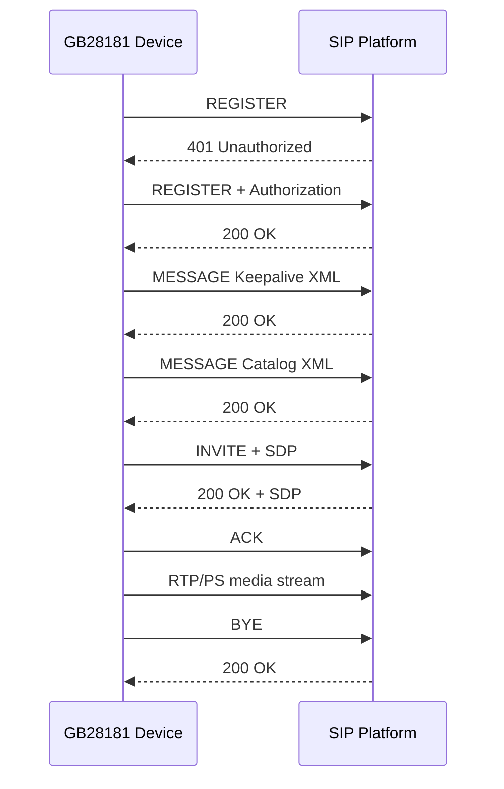
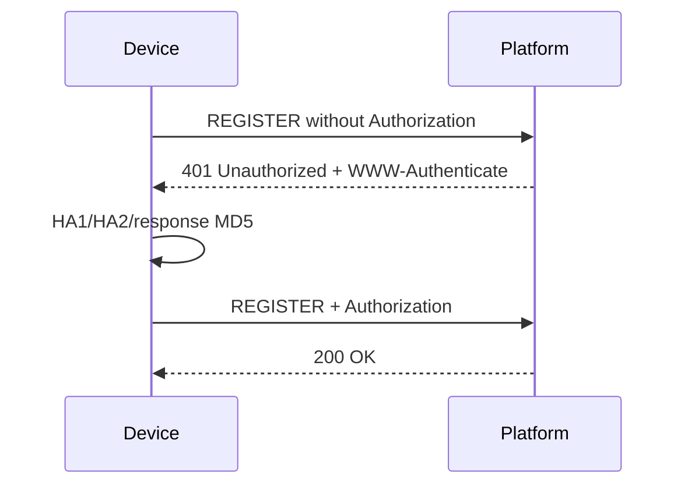
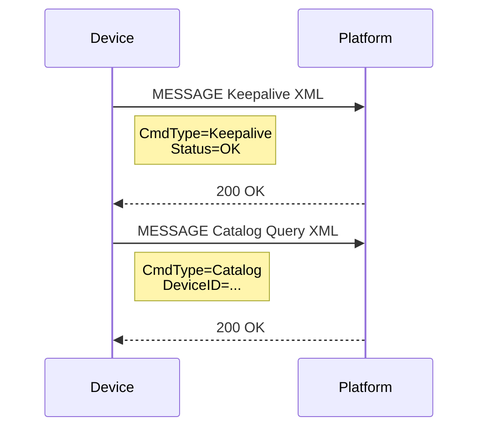
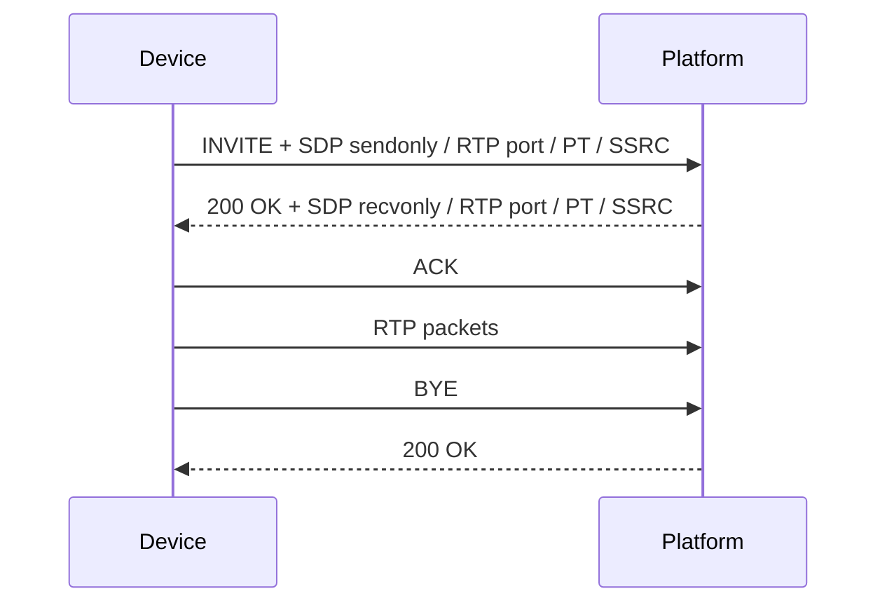
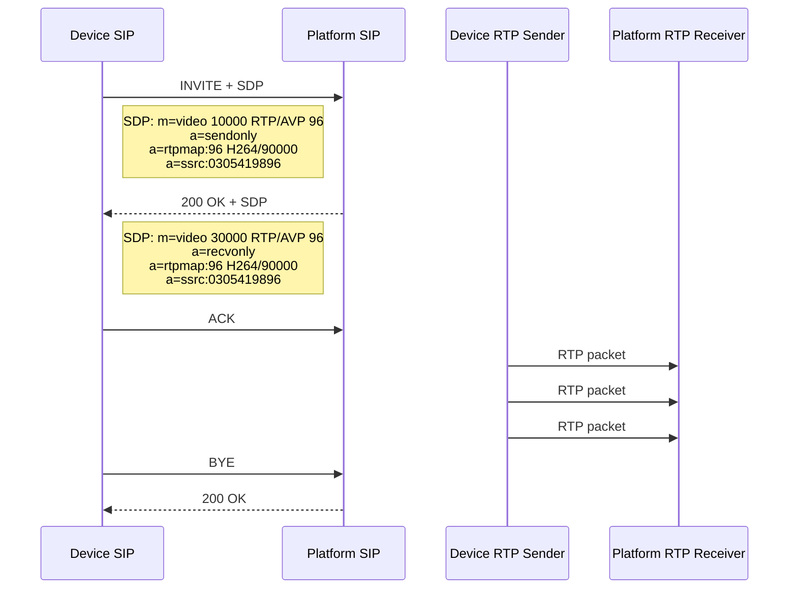
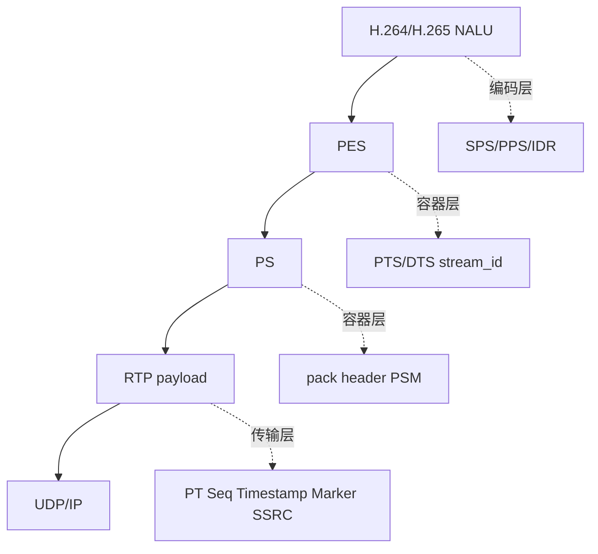
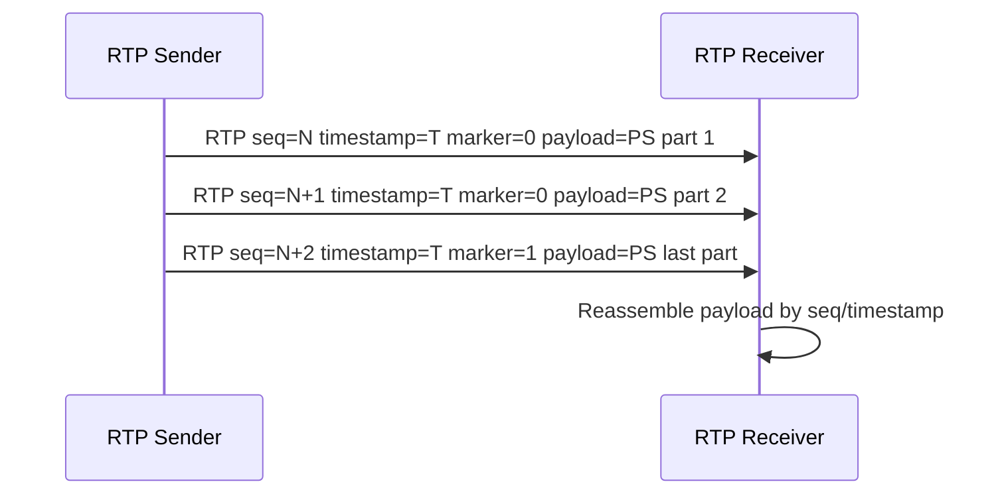

# GB28181 学习总纲

GB28181 不是容器格式，也不是单纯的 RTP 协议实现。它是一套国标监控联网协议，核心任务是把“设备、平台、会话、媒体流”组织起来。

```text
GB28181 = SIP 信令 + SDP 协商 + RTP/RTCP 承载
```

和其他层的关系可以这样拆：

```text
编码层: H.264 / H.265 / AAC
容器层: PS / TS / FLV / MP4
协议层: SIP / SDP / RTP / RTCP / GB28181
传输层: UDP / TCP / TLS
```

## 1. 为什么要分层

分层的目的不是概念化，而是为了把职责拆开：

- 编解码层负责“内容是什么”，例如一个 H.264 NALU 是 SPS、PPS 还是 IDR。
- 容器层负责“文件里怎么装”，例如 PS、TS、FLV、MP4 如何组织音视频数据。
- 协议层负责“怎么协商、怎么传、怎么维护会话”，例如 SIP 建会话、SDP 描述媒体、RTP 传负载、RTCP 反馈统计。

GB28181 的重点不在“包里是什么编码帧”，而在“会话怎么建立、媒体参数怎么协商、媒体流怎么按约定送达”。

一个很重要的边界是：`REGISTER / MESSAGE / INVITE / ACK / BYE` 都属于 SIP 信令面；`SDP` 是信令 body 里的媒体描述；`RTP/RTCP` 才是媒体面。学习时不要把 XML 控制消息、SDP 描述文本、RTP payload 混成同一层。

## 2. GB28181 管什么

GB28181 主要回答这些问题：

1. 设备怎么注册到平台。
2. 平台怎么查询设备目录和状态。
3. 平台怎么发起实时预览或回放。
4. 媒体流的 IP、端口、编码类型、payload type、SSRC 怎么协商。
5. RTP 媒体包怎么发给平台。
6. 会话如何结束、如何 BYE。

最小流程可以先理解成：

```text
REGISTER
  -> 平台 200 OK 或 401 Unauthorized
  -> 如果是 401，设备用 Digest 鉴权后重新 REGISTER

MESSAGE
  -> Keepalive / Catalog / DeviceInfo / DeviceStatus
  -> MESSAGE 本身是 SIP 方法，具体命令放在 XML body 里

其中 `Keepalive` 的意思就是“设备还在线”，`Catalog` 的意思就是“查目录/查通道”。

INVITE + SDP
  -> 协商媒体地址、端口、payload type、SSRC、编码名
  -> 平台 200 OK

RTP
  -> 发送 H.264 / H.265 / AAC payload

BYE
  -> 结束会话
```

完整最小交互图可以这样看：



这张图是 GB28181 最小闭环的总览。它把三件事串起来：先注册，再发业务控制消息，再建媒体会话，最后结束会话。

按顺序拆开看：

| 阶段 | 含义 |
|---|---|
| `REGISTER` | 设备先向平台表明自己在线 |
| `401 Unauthorized` | 平台要求设备做 Digest 鉴权 |
| `REGISTER + Authorization` | 设备带鉴权信息重发注册 |
| `MESSAGE Keepalive` | 设备上报保活，证明在线 |
| `MESSAGE Catalog` | 设备或平台发起目录查询 |
| `INVITE + SDP` | 设备发起媒体会话协商 |
| `200 OK + SDP` | 平台同意会话并给出媒体参数 |
| `ACK` | 设备确认会话建立 |
| `RTP/PS media stream` | 真正的音视频开始走 RTP |
| `BYE` | 设备结束会话 |
| `200 OK` | 平台确认结束 |

这张图的关键不是记住每个字，而是记住顺序：**先注册，再保活/查询，再协商媒体，再发 RTP，最后结束**。

## 3. SIP 是什么

SIP 是 GB28181 的事务和会话控制语言。它负责“谁和谁说话、说什么、什么时候结束”，但不直接承载音视频字节。

常见 SIP 方法：

| 方法 | 作用 |
|---|---|
| `REGISTER` | 设备注册到平台 |
| `INVITE` | 发起媒体会话，通常携带 SDP |
| `ACK` | 确认 INVITE |
| `BYE` | 结束会话 |
| `MESSAGE` | Keepalive、Catalog、DeviceInfo 等 XML 消息常用 |

常见 SIP 头字段：

| 字段 | 作用 |
|---|---|
| `Via` | 请求经过的路径和本端地址 |
| `From` / `To` | 会话两端标识，通常携带 tag |
| `Call-ID` | 同一事务/对话的标识 |
| `CSeq` | 请求序号和方法名 |
| `Contact` | 后续联系本端的地址 |
| `Content-Type` | body 类型，SDP 常见为 `application/sdp` |
| `Content-Length` | body 长度 |

响应最常见的是：

```text
SIP/2.0 200 OK
SIP/2.0 401 Unauthorized
```

学习时先抓这几个字段：`status_code`、`Call-ID`、`CSeq`、`From`、`To`、`Contact`、`Content-Length`、`body`。它们决定一条 SIP 事务是不是成功、是否需要鉴权、后续媒体协商是否成立。

### 3.1 Digest 鉴权

`401 Unauthorized` 之后，平台通常会要求 Digest 鉴权。设备要用 `WWW-Authenticate` 里的 `realm`、`nonce` 等信息重新计算响应值，再发第二次 `REGISTER` 或 `INVITE`。

这个闭环可以理解成：

```text
第一次 REGISTER / INVITE
  -> 401 Unauthorized
  -> 响应头里带 WWW-Authenticate: Digest realm=..., nonce=...
  -> 设备计算 Authorization: Digest ... response=...
  -> 再次发送 REGISTER / INVITE
```



这张图只讲 Digest 鉴权的最小闭环。它说明 `Authorization` 不是密码本身，而是设备根据平台给的 `WWW-Authenticate` challenge 计算出来的响应。

逐步理解：

| 步骤 | 含义 |
|---|---|
| `REGISTER without Authorization` | 第一次注册故意不带鉴权头，平台会拒绝 |
| `401 Unauthorized + WWW-Authenticate` | 平台下发 `realm`、`nonce`、`qop` 等挑战参数 |
| `HA1/HA2/response MD5` | 设备用用户名、密码、方法、URI 和 challenge 计算摘要 |
| `REGISTER + Authorization` | 设备把计算结果放进 Authorization 头重发 |
| `200 OK` | 平台验证通过，注册成功 |

对应到代码，就是 `gb28181_parse_www_authenticate()` 先拆 challenge，再由 `gb28181_build_digest_authorization()` 拼出 `Authorization`。

当前最小模块已经补了两块底座：

- `gb28181_parse_www_authenticate()`：解析 `realm` / `nonce` / `qop` / `opaque` / `algorithm`
- `gb28181_build_digest_authorization()`：根据用户名、密码、方法、URI 和 challenge 计算 `Authorization` 头

现在又补了一个最小 UDP 收发示例：

- `gb28181_sip_register_client.cpp`：发第一次 `REGISTER`，接 401，再发带 `Authorization` 的第二次 `REGISTER`

这还不是完整 SIP 状态机，但已经足够支撑你下一步接真实 401 响应做学习验证。

### 3.2 MESSAGE、Keepalive 和 Catalog

GB28181 里很多设备控制和查询不是靠新的传输连接完成，而是走 SIP `MESSAGE`。`MESSAGE` 这层仍然是 SIP 报文，头部继续使用 `Via / From / To / Call-ID / CSeq / Content-Type / Content-Length`，真正的业务命令放在 XML body 里。

在当前学习代码里，`Keepalive` 就是在线保活消息，`Catalog` 就是目录查询消息。前者回答“设备还活着吗”，后者回答“设备有哪些通道/资源”。

`gb28181_sip_register_client.cpp` 的 `main()` 前半段就是在学这一步：先让设备在线，再做基本查询，确认控制面能跑通。

当前最小模块补了两个学习用构造函数：

- `gb28181_build_message_keepalive()`：设备保活通知。
- `gb28181_build_message_catalog()`：目录查询请求。

Keepalive 的 body 示例：

```xml
<?xml version="1.0" encoding="GB2312"?>
<Notify>
<CmdType>Keepalive</CmdType>
<SN>3</SN>
<DeviceID>34020000001320000001</DeviceID>
<Status>OK</Status>
</Notify>
```

Catalog 查询的 body 示例：

```xml
<?xml version="1.0" encoding="GB2312"?>
<Query>
<CmdType>Catalog</CmdType>
<SN>4</SN>
<DeviceID>34020000001320000001</DeviceID>
</Query>
```

Catalog 响应链路现在已经补成最小闭环了：平台会先回一个 `200 OK`，再主动发一条目录响应 MESSAGE。这个目录响应里会包含最小的 `DeviceList`、`DeviceItem`、在线状态等字段，便于学习“查询 + 响应”这条链路。

外层 SIP 报文里重点看：

| 字段 | 学习重点 |
|---|---|
| `MESSAGE sip:... SIP/2.0` | 说明这是 SIP MESSAGE 方法，不是媒体数据 |
| `CSeq: 3 MESSAGE` | 同一端发出的事务序号，便于跟响应配对 |
| `Content-Type: Application/MANSCDP+xml` | GB28181 常用 XML 控制体 |
| `Content-Length` | XML body 的字节长度 |
| XML `<CmdType>` | 真正的业务命令，例如 `Keepalive` / `Catalog` |

抓包过滤可以用：

```text
sip || udp.port == 5060 || udp.port == 5062
```

在 Wireshark 里选中 `MESSAGE` 报文后，看两层内容：先看 SIP header 确认事务，再展开 message body 看 XML 的 `<CmdType>`、`<SN>`、`<DeviceID>`。这里没有 RTP，也没有 PS/PES/NALU，因为它是控制面消息。

MESSAGE 的最小交互图：



这张图讲的是 MESSAGE 控制消息，不是媒体流。它的重点在 XML body，而不是 SIP 头本身。

理解时抓两层：

| 层 | 看什么 |
|---|---|
| SIP 外层 | `Via`、`From`、`To`、`Call-ID`、`CSeq`、`Content-Type`、`Content-Length` |
| XML 内层 | `<CmdType>`、`<SN>`、`<DeviceID>`、`<Status>` |

两类 MESSAGE 含义不同：

| MESSAGE 类型 | 作用 |
|---|---|
| Keepalive | 设备保活，上报在线状态 |
| Catalog | 查询目录或通道列表 |

在当前学习代码里，`gb28181_sip_register_client.cpp` 发这两个 MESSAGE，`gb28181_sip_mock_server.cpp` 负责把 `<CmdType>` 解析出来再回 `200 OK`。

### 3.3 Catalog 查询与响应

Catalog 是 GB28181 里最常见的查询之一，作用是“查目录/查通道”。你可以把它理解成平台在问设备：

```text
你下面有哪些通道、哪些资源、哪些设备项可以被播放或管理？
```

Catalog 这条链路现在可以这样理解：

```text
设备发 MESSAGE Catalog Query
平台先回 SIP 200 OK
平台再发一条 Catalog Response MESSAGE
设备收到后，才真正拿到目录列表
```

Catalog 的查询请求和前面的 `Keepalive` 很像，外层仍然是 SIP `MESSAGE`，真正的业务命令放在 XML body 里。不同点在于：

- `Keepalive` 用 `<Notify>`，表示设备状态上报
- `Catalog` 用 `<Query>`，表示设备主动向平台查询目录

Catalog 查询的 body 现在在代码里对应 `gb28181_build_message_catalog()`，它会构造类似下面的 XML：

```xml
<?xml version="1.0" encoding="GB2312"?>
<Query>
<CmdType>Catalog</CmdType>
<SN>4</SN>
<DeviceID>34020000001320000001</DeviceID>
</Query>
```

这里最重要的字段是：

| 字段 | 作用 |
|---|---|
| `CmdType=Catalog` | 表示这是目录查询 |
| `SN` | 查询序号，便于和响应配对 |
| `DeviceID` | 发起查询的设备编号 |

平台收到后先回一个 `200 OK`，然后再发一条 `Catalog Response MESSAGE`。这条响应里一般会带目录列表、在线状态、通道编号、通道名称等信息。学习阶段可以先把它理解成“平台把设备树/通道树回给你”。

一个最小的 Catalog 响应 body 可以长成这样：

```xml
<?xml version="1.0" encoding="GB2312"?>
<Response>
<CmdType>Catalog</CmdType>
<SN>4</SN>
<DeviceID>34020000001320000001</DeviceID>
<SumNum>1</SumNum>
<DeviceList Num="1">
<Item>
<DeviceID>34020000001320000001</DeviceID>
<Name>Camera-01</Name>
<Manufacturer>MockVendor</Manufacturer>
<Model>IPC-MOCK-01</Model>
<Owner>3402000000</Owner>
<CivilCode>340200</CivilCode>
<Address>Mock Address</Address>
<Parental>0</Parental>
<ParentID>34020000002000000001</ParentID>
<SafetyWay>0</SafetyWay>
<RegisterWay>1</RegisterWay>
<Secrecy>0</Secrecy>
<Status>ON</Status>
</Item>
</DeviceList>
</Response>
```

这里可以这样读：

| 字段 | 作用 |
|---|---|
| `CmdType=Catalog` | 表示这是目录响应 |
| `SN` | 和查询请求里的 `SN` 对应 |
| `DeviceID` | 目录响应所属设备或平台编号 |
| `SumNum` | 目录总条数 |
| `DeviceList Num="1"` | 当前响应里包含 1 条目录项 |
| `Item` | 一条具体的设备/通道记录 |
| `Name` | 通道名称 |
| `Manufacturer` | 厂商 |
| `Model` | 型号 |
| `Owner` | 所属级联或平台编号 |
| `CivilCode` | 行政区划码 |
| `ParentID` | 父级节点编号 |
| `RegisterWay` | 注册方式 |
| `Status` | 在线状态，`ON` 表示在线 |

`Item` 本身就是一条目录记录，里面这些字段可以这样理解：

| 字段 | 作用 |
|---|---|
| `DeviceID` | 这一条目录项自己的编号 |
| `Name` | 通道或设备名称 |
| `Manufacturer` | 厂商 |
| `Model` | 型号 |
| `Owner` | 上级归属编号，常见于级联场景 |
| `CivilCode` | 行政区划码 |
| `Address` | 地址信息 |
| `Parental` | 是否有父子级联关系 |
| `ParentID` | 父级目录编号 |
| `SafetyWay` | 安全接入方式 |
| `RegisterWay` | 注册方式 |
| `Secrecy` | 是否保密 |
| `Status` | 当前在线状态 |

当前 mock 代码返回的是一条固定目录项，目的不是模拟完整设备树，而是让你先把“目录查询 -> 目录响应 -> 解析字段”这条链路跑通。真正工程里，这一层通常会扩展成多级树、多条通道和级联设备列表。

最小响应里一般会看到这些字段：

| 字段 | 作用 |
|---|---|
| `CmdType` | 仍然是 `Catalog`，表示目录相关消息 |
| `SN` | 用来和查询请求对上号 |
| `DeviceID` | 当前目录消息对应的设备或平台编号 |
| `SumNum` | 目录里总共有多少条记录 |
| `DeviceList` | 通道列表容器 |
| `Item` | 单个通道或设备条目 |
| `Status` | 在线/离线状态 |

如果你在 Wireshark 里看 Catalog，重点是两层：

1. SIP 头里的 `CSeq`、`Call-ID`、`Content-Type`、`Content-Length`
2. XML body 里的 `CmdType`、`SN`、`DeviceID`、`DeviceList`

也就是说，Catalog 既是一次查询，也是一次“目录结构返回”的学习样本。你后面看 `DeviceInfo` / `DeviceStatus` 时，可以把它们当成同一类 MESSAGE 查询的不同业务命令。
| `Item` | 单个通道或设备条目 |
| `Status` | 在线/离线状态 |

目前 mock 版本返回的是固定的一条目录项，后续可以把它扩展成真正的设备树或通道树。

### 3.4 DeviceInfo 与 DeviceStatus

在 GB28181 里，除了目录查询，常见的两个查询消息还有 `DeviceInfo` 和 `DeviceStatus`。它们和 Catalog 一样，都是通过 SIP `MESSAGE` 承载 XML body。区别只是业务语义不同：

| 消息 | 含义 |
|---|---|
| `DeviceInfo` | 查询设备基本信息，例如名称、厂商、型号、固件版本 |
| `DeviceStatus` | 查询设备在线状态、编码状态、录像状态等 |

从请求格式看，它们和 Catalog 很像，都是 `MESSAGE + XML`，只是 `CmdType` 不同：

```xml
<?xml version="1.0" encoding="GB2312"?>
<Query>
<CmdType>DeviceInfo</CmdType>
<SN>6</SN>
<DeviceID>34020000001320000001</DeviceID>
</Query>
```

```xml
<?xml version="1.0" encoding="GB2312"?>
<Query>
<CmdType>DeviceStatus</CmdType>
<SN>8</SN>
<DeviceID>34020000001320000001</DeviceID>
</Query>
```

这就是 `gb28181_build_message_device_info_query()` 和 `gb28181_build_message_device_status_query()` 这两个函数真正要教你的东西：同一套 SIP MESSAGE 外壳，换一个 XML 命令，就变成另一类设备查询。

它们的最小验证方式和 Catalog 一样：

```text
设备发 MESSAGE DeviceInfo Query
平台先回 SIP 200 OK
平台再发 DeviceInfo Response MESSAGE

设备发 MESSAGE DeviceStatus Query
平台先回 SIP 200 OK
平台再发 DeviceStatus Response MESSAGE
```

最小响应里一般会看这些字段：

| 字段 | 作用 |
|---|---|
| `CmdType` | 分别是 `DeviceInfo` / `DeviceStatus` |
| `SN` | 用来和查询请求对号 |
| `DeviceID` | 当前设备编号 |
| `DeviceName` | 设备名称 |
| `Manufacturer` | 厂商 |
| `Model` | 型号 |
| `Firmware` | 固件版本 |
| `Online` | 在线状态 |
| `Encode` | 编码状态 |
| `Record` | 录像状态 |

`DeviceInfo` 响应可以理解成“这个设备是谁、什么型号、什么固件”：

| 字段 | 作用 |
|---|---|
| `DeviceName` | 设备显示名 |
| `Manufacturer` | 厂商 |
| `Model` | 型号 |
| `Firmware` | 固件版本 |
| `Result` | 请求结果，通常为 `OK` |

`DeviceStatus` 响应可以理解成“这个设备现在怎么样”：

| 字段 | 作用 |
|---|---|
| `Online` | 是否在线 |
| `Status` | 状态概览，常见为 `OK` |
| `Encode` | 编码状态，例如 H264 |
| `Record` | 录像状态 |

在当前 mock 里，平台返回的是固定响应，便于学习请求-响应配对。你在 Wireshark 里可以直接按 `CSeq` 和 `CmdType` 对照：先看查询 MESSAGE，再看平台回的 Response MESSAGE，最后确认设备回的 `200 OK` 没有被误当成新的请求。

当前这两类消息先做最小链路验证，后面可以继续扩展成更接近真实平台的字段集合。

本次最小代码已经验证的 MESSAGE 查询闭环是：

```text
MESSAGE Catalog Query
平台返回 SIP 200 OK
平台再发送 MESSAGE Catalog Response
设备返回 SIP 200 OK

MESSAGE DeviceInfo Query
平台返回 SIP 200 OK
平台再发送 MESSAGE DeviceInfo Response
设备返回 SIP 200 OK

MESSAGE DeviceStatus Query
平台返回 SIP 200 OK
平台再发送 MESSAGE DeviceStatus Response
设备返回 SIP 200 OK
```

这里有一个容易踩坑的点：平台收到设备对响应 MESSAGE 返回的 `SIP/2.0 200 OK` 时，不能再把它当成新的请求处理。mock server 现在会识别 `msg.is_response` 并直接忽略这类响应报文，否则后续 DeviceInfo、DeviceStatus、INVITE 的接收队列会被错误的 `501 Not Implemented` 或旧 MESSAGE 污染。

## 4. SDP 是什么

SDP 是 SIP body 里的媒体描述文本。它不传媒体数据，只告诉对端“媒体要怎么传”。

一个最小例子：

```text
v=0
o=34020000001320000001 0 0 IN IP4 192.168.1.10
s=Play
c=IN IP4 192.168.1.10
t=0 0
m=video 10000 RTP/AVP 96
a=sendonly
a=rtpmap:96 H264/90000
a=ssrc:0300000001
```

字段含义：

| 字段 | 含义 |
|---|---|
| `v=0` | SDP 版本 |
| `o=` | origin，会话发起者和版本信息 |
| `s=` | session name |
| `c=IN IP4 ...` | 媒体连接地址 |
| `t=0 0` | 会话时间，实时预览常用 `0 0` |
| `m=video 10000 RTP/AVP 96` | 媒体类型、端口、传输协议、payload type |
| `a=sendonly` | 本端只发送媒体 |
| `a=recvonly` | 本端只接收媒体 |
| `a=rtpmap:96 H264/90000` | payload type 96 对应 H.264，clock rate 90000 |
| `a=ssrc:...` | RTP 同步源标识 |

要特别注意：`m=` 行里的端口和 IP 是 RTP 传输端口，不是 SIP 5060 端口。SIP 负责谈事，RTP 负责传媒体。

INVITE/SDP 建立媒体会话的时序：



这张图表达的是“先用 SIP/SDP 谈好媒体参数，再用 RTP 传媒体”。不要把 `INVITE + SDP` 理解成已经开始传视频，它只是建会话和协商参数。

可以拆成两条通道看：

```text
SIP 信令通道:
Device SIP port <-> Platform SIP port
负责 INVITE / 200 OK / ACK / BYE

RTP 媒体通道:
Device RTP sender -> Platform RTP receiver
负责真正的音视频 RTP packet
```

更详细的时序图：



这张图是 INVITE/SDP 会话建立的细化版，和上一张总览图是同一件事，只是拆得更明确：**SIP 负责谈参数，RTP 负责发媒体**。

读图时把两条通道分开：

| 通道 | 作用 |
|---|---|
| SIP 通道 | 传 `INVITE / 200 OK / ACK / BYE` 这类控制报文 |
| RTP 通道 | 真正传视频或音频包 |

再看 SDP 参数：

| 字段 | 含义 |
|---|---|
| `m=video 10000 RTP/AVP 96` | 设备建议的 RTP 发送端口、payload type |
| `a=sendonly` | 设备只发不收 |
| `m=video 30000 RTP/AVP 96` | 平台建议的 RTP 接收端口、payload type |
| `a=recvonly` | 平台只收不发 |
| `a=rtpmap:96 H264/90000` | 双方都同意 PT 96 表示 H.264 |
| `a=ssrc:0305419896` | RTP 同步源标识 |

这几个字段要和后面的 RTP 包对应起来看：

| SDP 字段 | 对应 RTP/媒体层含义 |
|---|---|
| `m=video` | 这路媒体是视频 |
| `10000` / `30000` | RTP 端口，不是 SIP 端口 |
| `RTP/AVP` | 使用 RTP Audio/Video Profile |
| `96` | 动态 payload type，后续 RTP 头里的 PT 要等于 96 |
| `H264/90000` | PT 96 对应 H.264，RTP timestamp 使用 90kHz 时钟 |
| `sendonly` | 当前端只发送媒体 |
| `recvonly` | 当前端只接收媒体 |
| `ssrc` | 后续 RTP 包里的 SSRC 应该和这里一致 |

所以 SDP 不是媒体数据，而是给后面的 RTP 包立规则。抓包时可以这样对照：

```text
SDP: a=rtpmap:96 H264/90000
RTP: Payload type = 96, Timestamp 按 90000 Hz 增长

SDP: a=ssrc:0305419896
RTP: SSRC = 0305419896

SDP: m=video 30000 RTP/AVP 96
UDP: 目的端口是 30000，RTP payload type 是 96
```

如果 SDP 和 RTP 对不上，播放器或平台就可能收到了包但无法按正确格式解释。例如 SDP 写 `H264/90000`，但 RTP payload 实际装的是 PS，或者 RTP 头里的 payload type 不是 96，都会造成解析异常。

在当前代码里，`gb28181_sip_register_client.cpp` 负责这条 SIP 会话链，`gb28181_minimal_example.cpp` 负责演示后面的 RTP 媒体包。

`gb28181_sip_register_client.cpp` 的 `main()` 后半段从这里开始：`INVITE + SDP` 谈参数，`ACK` 确认会话，`BYE` 结束会话。

每一步的含义：

| 步骤 | 含义 |
|---|---|
| `INVITE + SDP` | 设备发起媒体会话，并在 SDP 里说明自己准备怎么发送媒体 |
| `200 OK + SDP` | 平台同意会话，并在 SDP 里说明自己准备在哪个地址、端口接收媒体 |
| `ACK` | 设备确认收到 `200 OK`，SIP 建会话三步完成 |
| `RTP packets` | 真正开始传音视频数据，已经不是 SIP 报文 |
| `BYE` | 设备请求结束这次媒体会话 |
| `200 OK` | 平台确认会话结束 |

对应到当前学习代码：

| 代码 | 学习内容 |
|---|---|
| `gb28181_sip_register_client.cpp` | 构造 `INVITE + SDP`、发送 `ACK`、发送 `BYE` |
| `gb28181_sip_mock_server.cpp` | 收 `INVITE` 后返回 `200 OK + SDP`，收 `BYE` 后返回 `200 OK` |
| `gb28181_minimal_example.cpp` | 单独演示 RTP packet、PS over RTP、RTP 分片 |

当前示例里 SIP 会话控制和 RTP 媒体发送是分开演示的：`gb28181_sip_register_client.exe` 用来学 SIP/SDP 会话控制，`gb28181_minimal_example.exe` 用来学 RTP/PS over RTP 媒体承载。

### 4.1 SDP 和容器头是不是重叠

不重叠，但信息有交集。

- 容器头描述的是“文件内部怎么组织数据”。
- SDP 描述的是“网络上怎么实时传输这些数据”。

例如编码名、采样率、通道数、分辨率这些信息可能在容器和 SDP 里都能看到，但作用不同：一个面向文件，一个面向实时会话。

## 5. RTP 是什么

RTP 是真正承载媒体负载的传输格式。GB28181 常用 RTP/RTCP 承载音视频。

RTP 头部里最重要的字段：

| 字段 | 作用 |
|---|---|
| Payload Type | 对应 SDP 中的 `m=` 和 `a=rtpmap` |
| Sequence Number | 包序号，用于检测丢包和乱序 |
| Timestamp | 媒体时间戳，视频常用 90000 Hz 时钟 |
| SSRC | 同步源标识 |
| Marker | 常用于标记一个访问单元结束或关键边界 |

RTP payload 里放的是编码层数据，不是容器文件。它可以是：

- H.264 NALU 的 RTP 负载格式
- H.265 NALU 的 RTP 负载格式
- AAC 的 RTP 负载格式

RTP 不负责理解 SPS、PPS、VPS、IDR 的语义，它只负责分包、编号、时间戳和发送。

### 5.1 负载层和编码层的关系

可以把它理解为：

```text
H.264/H.265 帧 = 包裹内容
RTP = 快递单 + 快递袋
SIP/SDP = 下单和收件地址信息
UDP/IP = 运输车辆和道路
```

这也是为什么 `RTP` 和 `GB28181` 不等价。GB28181 负责把路和地址谈好，RTP 负责把包裹送过去。

## 6. RTCP 是什么

RTCP 是 RTP 的配套控制协议，负责统计和同步。

常见作用：

- 汇报收包质量、丢包、抖动
- 同步音视频流
- 发送 BYE，结束同步源

在 GB28181 的学习阶段，RTCP 常常被低估，但它不是可有可无。它至少帮助你理解：RTP 不是单向裸发包，协议本身还有反馈和统计。

## 7. GB28181 与 RTSP / RTMP 的关系

可以把它们类比成：

```text
SIP / RTSP / GB28181 = 接单和调度系统
RTP = 负责送货的快递车
H.264 / H.265 / AAC = 包裹内容
PS / TS / FLV / MP4 = 包裹箱子
```

其中：

- RTSP 更偏控制实时拉流会话。
- GB28181 更偏国标监控体系里的设备接入和平台联动。
- RTMP 更偏推流链路里的经典直播协议。

## 8. 当前仓库里的最小 GB28181 模块

位置：

```text
E:\code\Media\MediaProtrocl\GB28181
```

核心文件：

- `gb28181_module.h`
- `gb28181_module.cpp`
- `gb28181_minimal_example.cpp`

当前模块已经覆盖：

1. `REGISTER` 文本生成。
2. `INVITE + SDP` 文本生成。
3. `BYE` 文本生成。
4. `MESSAGE Keepalive / Catalog` 文本和 XML body 生成。
5. SIP 响应的基础头字段解析。
6. 从 XML body 提取 `<CmdType>` 等简单字段。
7. 使用 `jrtplib` 建立 RTP 会话并发送 payload。

### 8.1 `gb28181_module.h` 的边界

这个头文件只保留最小学习接口：

- `gb28181_config_t`：配置
- `gb28181_sip_message_t`：SIP 解析结果
- `gb28181_create / start / stop / destroy`：生命周期
- `gb28181_build_register / invite / bye / sdp`：报文构造
- `gb28181_build_message_keepalive / catalog`：MESSAGE + XML 构造
- `gb28181_extract_xml_tag`：学习用 XML 标签提取
- `gb28181_parse_sip_message`：基础响应解析
- `gb28181_send_rtp_packet`：RTP 发送

### 8.2 `gb28181_module.cpp` 实际做了什么

内部用的是 `jrtplib`，不是自己手写 RTP socket。

关键流程是：

```text
gb28181_start()
  -> RTPSessionParams::SetOwnTimestampUnit(1.0 / 90000.0)
  -> RTPSessionParams::SetUsePredefinedSSRC(true)
  -> RTPSessionParams::SetPredefinedSSRC(ssrc)
  -> RTPUDPv4TransmissionParams::SetPortbase(local_rtp_port)
  -> RTPSession::Create(...)
  -> RTPSession::AddDestination(remote_rtp_ip, remote_rtp_port)

gb28181_send_rtp_packet()
  -> RTPSession::SendPacket(payload, len, payload_type, marker, timestamp_inc)
```

这里的 `timestamp_inc` 是“发完当前包后，时间戳增加多少”，不是绝对 PTS。

## 9. 当前最小模块还没做完什么

现在的模块适合学习，不是完整国标设备端。还缺这些能力：

- 完整 SIP UDP/TCP 收发框架
- 完整 SIP 客户端状态机
- Catalog 响应列表解析
- DeviceInfo / DeviceStatus XML
- INVITE / ACK / BYE 的完整 dialog 状态管理
- H.264 / H.265 RTP 分片器，例如 H.264 FU-A、H.265 FU
- RTP over TCP 或国标主动/被动模式

其中 Digest 的“头字段解析 + Authorization 生成”已经有最小实现，缺的是把它接到真实 socket 收发循环里。

## 10. 如何验证

最小验证思路是：

1. 先构造 `REGISTER` / `INVITE + SDP` 文本，确认字段正确。
2. 再用 `jrtplib` 发一个简单 RTP payload。
3. 用 Wireshark 抓回环网卡，看 RTP 头部字段是否和预期一致。
4. 再补真实的分片和真实的 SIP 会话控制。

Wireshark 里重点看：

- `udp.port == 10000`
- `rtp`
- `ssrc`
- `sequence number`
- `timestamp`
- `payload type`

如果你在做 RTP 的学习，建议把 `gb28181_minimal_example.cpp` 和 Wireshark 抓包结果一起看，这样最容易把“信令、协商、承载”三层分开。

### 10.1 当前可跑的 SIP 学习闭环

现在还可以先只看 SIP / Digest，不接真实平台：

```text
gb28181_sip_mock_server.exe
  -> 回 401，再回 200

gb28181_sip_register_client.exe
  -> 第一次 REGISTER
  -> 401 Unauthorized
  -> 第二次 REGISTER + Authorization
  -> 200 OK
  -> MESSAGE Keepalive
  -> 200 OK
  -> MESSAGE Catalog
  -> 200 OK
  -> INVITE + SDP
  -> 200 OK + SDP
  -> ACK
  -> BYE
  -> 200 OK
```

这个 mock 闭环的作用是确认：

- SIP 报文头是否能被正确解析
- Digest 的 `realm / nonce / qop` 是否能被正确提取
- `Authorization` 是否能被正确生成并回送
- MESSAGE XML 的 `<CmdType>`、`<SN>`、`<DeviceID>` 是否能被识别
- `INVITE / ACK / BYE` 的最小会话状态是否能跑通

### 10.2 下一步：PS over RTP

在国标场景里，常见媒体链路不是直接把 H.264 NALU 扔给对端，而是：

```text
H.264 NALU
  -> PES
  -> PS
  -> RTP
```

对应分层图：



这张图是媒体封装链路的分层图。它想表达的是：真正的视频编码数据先进入容器层，再进入 RTP 传输层。

各层职责：

| 节点 | 职责 |
|---|---|
| `H.264/H.265 NALU` | 编解码层，表示具体帧和参数集 |
| `PES` | 把编码数据包装成节目元素流 |
| `PS` | 把 PES 再包装成节目流容器 |
| `RTP payload` | 把容器内容装进网络传输载荷 |
| `UDP/IP` | 真正把字节送到对端 |

这张图也解释了为什么 GB28181 常见的是 `RTP -> PS -> PES -> NALU`，而不是直接把裸 H.264 帧扔给对端。

所以下一步的学习重点是：

- 看懂 PS pack header / PES header / PTS
- 看懂 RTP payload 里装的是 PS 还是裸 H.264
- 用 WinHex 比对 `00 00 01 BA`、`00 00 01 E0` 和 PES 里的 NALU 起始码

如果你用 WinHex 看 `gb28181_build_ps_pack_h264()` 的输出，可以按下面的顺序找：

```text
00 00 01 BA
  -> PS pack header 起始

00 00 01 E0
  -> 视频 PES 起始

80 80 05
  -> PES 标志和 PES header 长度，表示这里只写 PTS

PTS 5 字节
  -> 90kHz 时间戳

00 00 00 01 67 / 68 / 65
  -> 原始 H.264 Annex-B NALU
```

这几段字节的作用是分层定位：先找到容器头，再找到 PES 头，最后才进入真正的视频 NALU。这样你在排查灰屏、跳帧、GOP 异常时，能快速判断问题出在 PS、PES、RTP 还是编解码层。

当前 `gb28181_minimal_example.exe` 会连续演示两种 RTP payload：

```text
裸 H.264 over RTP:
  RTP payload 第一个字节通常是 67 / 68 / 65 等 NALU 头

PS over RTP:
  RTP payload 以 00 00 01 BA 开始
  后面能看到 00 00 01 E0 视频 PES
  PES payload 中保留 Annex-B 起始码: 00 00 00 01 67 / 68 / 65
```

抓包学习时可以直接看 RTP payload 开头：如果是 `65`，说明 payload 是 H.264 IDR NALU；如果是 `00 00 01 BA`，说明 payload 是 PS pack。

当 PS 数据超过单个 RTP payload 能承载的大小时，需要把同一段 PS 数据拆成多个 RTP 包：

```text
RTP packet #1: marker=0, timestamp 不递增，payload 是 PS 的前半段
RTP packet #2: marker=0, timestamp 不递增，payload 是 PS 的中间段
RTP packet #N: marker=1, timestamp 递增，payload 是 PS 的最后一段
```

分片时序可以这样看：



这张图讲的是 RTP 分片。它的重点不在“拆了几包”，而在“这些包怎么被同一个接收端重新拼回去”。

需要同时看三个字段：

| 字段 | 作用 |
|---|---|
| `sequence number` | 标记包顺序，帮助重组和发现丢包 |
| `timestamp` | 表示这些包属于同一个媒体时刻 |
| `marker` | 标记这个媒体单元的最后一包 |

在当前示例里，`max_payload=24` 是故意把 PS 数据切得很碎，方便你在 Wireshark 里观察同一组 RTP 包的 seq、timestamp 和 marker 变化。`max_payload=1200` 则更接近工程里常见的单包大小。

当前 `gb28181_minimal_example.exe` 也会用 `max_payload=24` 强制演示一次 PS over RTP 分片，便于抓包观察同一个 PS pack 被拆进多个 RTP 包后的 `sequence number / marker / timestamp` 变化。

运行这个示例时，建议按下面顺序看输出：

1. 先看 `PS PACK (H.264)` 十六进制输出，确认 `00 00 01 BA`、`00 00 01 E0`、`00 00 00 01 67/68/65`。
2. 再看 `sending one H.264 access unit`，确认裸 H.264 RTP 里发送的是 SPS / PPS / IDR。
3. 再看 `sending one PS-over-RTP packet`，确认整个 PS pack 被当成一个 RTP payload。
4. 再看 `sending fragmented PS-over-RTP packets: max_payload=24`，确认同一个 PS 被拆成多个 RTP 包。
5. 最后看 `sending normal PS-over-RTP packets: max_payload=1200`，确认更接近工程尺寸的发送方式。

抓包时可以直接把程序输出和 Wireshark 的 `udp.port == 10000` 对照起来：输出负责告诉你“这一轮发的是什么”，Wireshark 负责告诉你“实际上包里长什么样”。

示例里还保留一个更接近工程参数的发送路径：

```text
normal max_payload=1200
```

它用一段更大的模拟 H.264 Annex-B 数据生成 PS，再按 1200 字节左右切 RTP payload。真实工程通常会让前面的 RTP payload 尽量接近 1200/1400，最后一包发剩余数据，避免超过 MTU 后触发 IP 分片。

## 11. 典型误区

### 11.1 把 GB28181 当成 RTP

这是最常见的误区。GB28181 不是 RTP，RTP 只是它后半段承载媒体的那部分。

### 11.2 把 SDP 当成媒体数据

SDP 只描述媒体，不传媒体。

### 11.3 把容器头和协议头混为一谈

容器层解决文件组织，协议层解决网络协商。它们可以重复表达编码信息，但职责不同。

### 11.4 把 I 帧和 IDR 帧完全等同

IDR 是一种 I 帧，但 I 帧不一定是 IDR。IDR 的特点是不会引用更早的参考帧，适合作为随机访问点。

## 12. 学习顺序建议

建议顺序是：

1. 先把 `REGISTER -> INVITE + SDP -> RTP -> BYE` 跑通。
2. 再补 `401 Digest`。
3. 再补 `MESSAGE` / `Catalog` / `DeviceInfo`。
4. 再补真正的 H.264/H.265 RTP 分片。
5. 最后再看真实设备联调和异常恢复。

## 13. 现有文件入口

- [GB28181 README](GB28181/README.md)
- [GB28181 minimal example](GB28181/gb28181_minimal_example.cpp)
- [GB28181 module header](GB28181/gb28181_module.h)
- [GB28181 module implementation](GB28181/gb28181_module.cpp)
