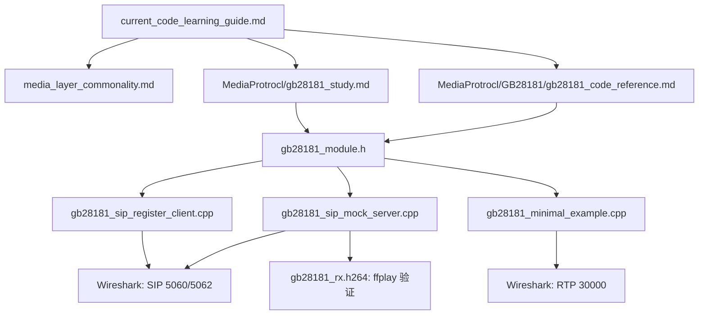
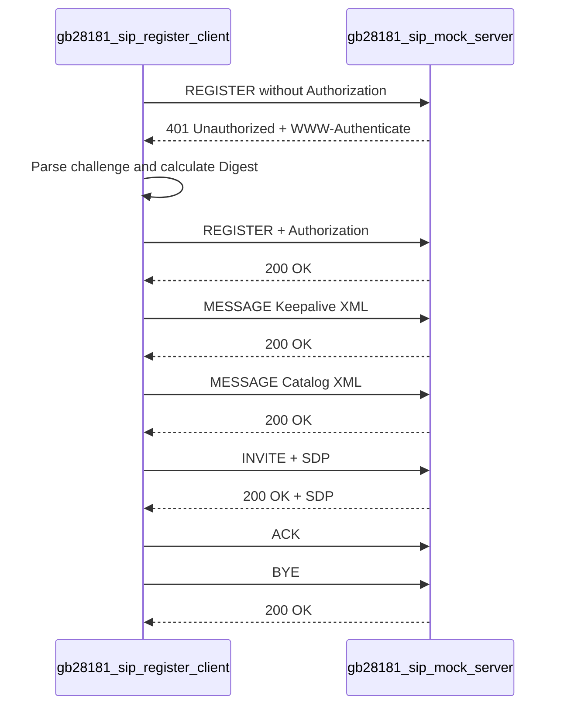
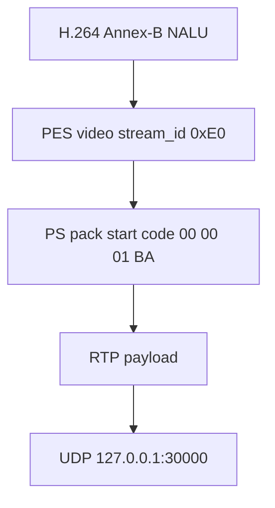

# 当前代码学习路线

这份文档用于指导如何学习当前仓库里的代码。建议顺序是：先跑通程序，再用 Wireshark/WinHex 观察字节和报文，最后回到代码里逐层阅读。

当前最适合从 GB28181 模块开始，因为它已经具备最小可运行闭环：SIP 注册鉴权、MESSAGE Keepalive/Catalog、INVITE/SDP、BYE，以及 RTP/PS over RTP 示例。

## 0. 当前代码入口图



这张图的读法是：先读总纲，再看 GB28181 模块接口（`gb28181_study.md` 讲协议、`gb28181_code_reference.md` 讲代码能力），随后分别跑 SIP client/server 和 RTP 示例，用抓包反向验证字段，最后用 `ffplay gb28181_rx.h264` 验证接收重组闭环。

## 1. 先建立分层概念

先读：

- [media_layer_commonality.md](media_layer_commonality.md)
- [MediaProtrocl/gb28181_study.md](MediaProtrocl/gb28181_study.md)

先记住这条主线：

```text
GB28181 = SIP 信令 + SDP 协商 + RTP/RTCP 承载
常见媒体链路 = H.264 NALU -> PES -> PS -> RTP
```

每看到一个字段，先判断它属于哪一层：

```text
SIP Via / CSeq / Call-ID      -> 信令事务层
MESSAGE XML CmdType / DeviceID -> 业务控制消息
SDP m= / a=rtpmap / a=ssrc    -> 媒体参数描述层
RTP seq / timestamp / marker  -> 媒体传输层
PS 00 00 01 BA                -> 容器层
PES 00 00 01 E0 / PTS         -> 容器层里的 elementary stream 包装
H.264 67 / 68 / 65            -> 编解码层
```

## 2. 跑 SIP 闭环

打开两个 PowerShell 窗口。

窗口 1 运行 mock server：

```powershell
E:\code\Media\MediaProtrocl\GB28181\out\buildBin\gb28181_sip_mock_server.exe
```

窗口 2 运行 client：

```powershell
E:\code\Media\MediaProtrocl\GB28181\out\buildBin\gb28181_sip_register_client.exe
```

预期流程：

```text
REGISTER
401 Unauthorized
REGISTER + Authorization
200 OK
MESSAGE Keepalive
200 OK
MESSAGE Catalog
200 OK
INVITE + SDP
200 OK + SDP
ACK
BYE
200 OK
```

对应时序图：



这一阶段只看 SIP 信令，不看 RTP 媒体数据。

## 3. 用 Wireshark 看 SIP

抓回环网卡，过滤：

```text
sip || udp.port == 5060 || udp.port == 5062
```

重点看：

| 报文 | 观察点 |
|---|---|
| `REGISTER` | `Via`、`From`、`To`、`Call-ID`、`CSeq`、`Contact` |
| `401 Unauthorized` | `WWW-Authenticate` 里的 `realm`、`nonce`、`qop` |
| 第二次 `REGISTER` | `Authorization` 里的 Digest response |
| `MESSAGE Keepalive` | XML body 里的 `<CmdType>Keepalive</CmdType>` |
| `MESSAGE Catalog` | XML body 里的 `<CmdType>Catalog</CmdType>` |
| `INVITE + SDP` | `Content-Type: application/sdp` 和 SDP body |
| `BYE` | 会话结束事务 |

这里要区分两种 SIP body：

```text
MESSAGE XML = 业务控制命令，比如 Keepalive、Catalog
SDP         = 媒体参数说明，比如端口、payload type、编码、SSRC
```

## 4. 跑 RTP / PS over RTP 示例

运行：

```powershell
E:\code\Media\MediaProtrocl\GB28181\out\buildBin\gb28181_minimal_example.exe
```

这个程序会发送几类 RTP payload：

```text
裸 H.264 SPS/PPS/IDR over RTP
PS over RTP
强制小包分片 PS over RTP
正常 1200 字节左右分片 PS over RTP
```

Wireshark 抓回环网卡，过滤：

```text
udp.dstport == 30000
```

如果 Wireshark 没自动识别 RTP，可以用命令打开抓包：

```powershell
& 'E:\tool\Wireshark\Wireshark.exe' -r '你的抓包文件.pcapng' -d udp.port==30000,rtp
```

重点看 RTP 头：

| 字段 | 观察点 |
|---|---|
| Payload type | 示例里是动态类型 `96` |
| Sequence number | 是否连续递增 |
| Timestamp | 同一个 PS 分片组应保持同一时间戳语义 |
| Marker | 最后一包为 `1`，前面分片为 `0` |
| SSRC | 示例里是 `0x12345678` |

再看 RTP payload：

```text
裸 H.264:
67 -> SPS
68 -> PPS
65 -> IDR

PS over RTP:
00 00 01 BA -> PS pack
00 00 01 E0 -> video PES
00 00 00 01 67 -> SPS
00 00 00 01 68 -> PPS
00 00 00 01 65 -> IDR
```

mock server 收到 RTP 后会继续往里拆，不依赖 Wireshark：

```text
version/pt/marker/seq/timestamp/ssrc
payload head: ...
payload type guess: PS pack header 00 00 01 BA / raw H.264 IDR / H.264 FU-A
PS scan: pack_start=.. video_pes=.. annexb_nalu=..
FU-A detail: indicator=0x.. header=0x.. S/E/type role=first/middle/last
FU-A reassembled NALU: len=.. header=0x65
```

FU-A 重组完成后，mock server 会把完整 NALU 写入运行目录 `gb28181_rx.h264`（Annex-B 裸流）：

```powershell
ffplay gb28181_rx.h264
# 或只验证能否被正确解封装：
ffmpeg -i gb28181_rx.h264 -f null -
```

注意 demo 媒体是固定 SPS/PPS/IDR 测试字节，画面只有一帧/几帧，验证目标是"接收重组链路正确"，不是"能播长视频"。

PS over RTP 的载荷关系图：



## 5. 按顺序读代码

### 5.1 先读头文件

入口：

- [MediaProtrocl/GB28181/gb28181_module.h](MediaProtrocl/GB28181/gb28181_module.h)

先看模块暴露了哪些能力：

```cpp
gb28181_build_register()
gb28181_build_message_keepalive()
gb28181_build_message_catalog()
gb28181_build_message_catalog_response()
gb28181_build_message_device_info_query()
gb28181_build_message_device_info()
gb28181_build_message_device_status_query()
gb28181_build_message_device_status()
gb28181_build_invite()
gb28181_build_bye()
gb28181_build_sdp()
gb28181_parse_sip_message()
gb28181_parse_www_authenticate()
gb28181_build_digest_authorization()
gb28181_build_ps_pack_h264()
gb28181_send_rtp_packet()
gb28181_send_rtp_payload_fragmented()
gb28181_send_h264_fu_a()
```

头文件解决的是“这个模块能做什么”，不要先陷入实现细节。函数全量清单和能力边界见 [MediaProtrocl/GB28181/gb28181_code_reference.md](MediaProtrocl/GB28181/gb28181_code_reference.md) 第 4 节。

### 5.2 再读 SIP client

入口：

- [MediaProtrocl/GB28181/gb28181_sip_register_client.cpp](MediaProtrocl/GB28181/gb28181_sip_register_client.cpp)

看它如何串起 SIP 流程：

```text
发 REGISTER
收 401
解析 WWW-Authenticate
生成 Authorization
再发 REGISTER
发 MESSAGE Keepalive
发 MESSAGE Catalog
发 INVITE
发 ACK
发 BYE
```

这一份代码是学习 SIP 事务顺序的主入口。

### 5.3 再读 mock server

入口：

- [MediaProtrocl/GB28181/gb28181_sip_mock_server.cpp](MediaProtrocl/GB28181/gb28181_sip_mock_server.cpp)

看它如何模拟平台：

```text
收到无鉴权 REGISTER -> 回 401
收到带 Authorization REGISTER -> 回 200
收到 MESSAGE -> 解析 XML CmdType -> 回 200，再回 Catalog/DeviceInfo/DeviceStatus Response
收到 INVITE -> 回 200 + SDP
收到 ACK -> 标记媒体会话建立
收到 BYE -> 回 200
收到 RTP(udp/30000) -> 拆 RTP 头 -> 识别 PS/裸H.264/FU-A -> 拆 PS 或 FU-A 重组 -> 落盘 gb28181_rx.h264
```

这份代码同时是 SIP 平台和 **RTP 接收端**。接收端能力（RTP 头解析、PS 拆层、FU-A 重组状态机）见 [MediaProtrocl/GB28181/gb28181_code_reference.md](MediaProtrocl/GB28181/gb28181_code_reference.md) 第 5 节。

### 5.4 再读 RTP 示例

入口：

- [MediaProtrocl/GB28181/gb28181_minimal_example.cpp](MediaProtrocl/GB28181/gb28181_minimal_example.cpp)

重点看：

```text
如何构造 SPS/PPS/IDR
如何生成 PS pack
如何发送裸 H.264 over RTP
如何发送 PS over RTP
如何按 max_payload 分片
```

这份代码要和 Wireshark 抓包一起看。

### 5.5 最后读模块实现

入口：

- [MediaProtrocl/GB28181/gb28181_module.cpp](MediaProtrocl/GB28181/gb28181_module.cpp)

最后再看实现细节：

```text
SIP 文本如何拼接
SDP 如何拼接
Digest MD5 如何计算
XML tag 如何提取
PS pack / PES / PTS 如何写字节
jrtplib 如何创建 RTP session
RTP 分片如何控制 marker/timestamp
```

## 6. 分阶段学习目标

如果想要一条"从零到看懂代码"的完整时间路径（6 阶段，每阶段标清读哪个文件/函数），见 [MediaProtrocl/GB28181/gb28181_code_reference.md](MediaProtrocl/GB28181/gb28181_code_reference.md) 第 10 节。本节下面的表是**技能维度**——按一个个技能点推进，适合已有基础、查漏补缺。

建议按这个顺序推进：

| 阶段 | 学习目标 | 验证方式 |
|---|---|---|
| 1 | SIP 文本和事务 | 跑 mock server + client，看 REGISTER/401/200 |
| 2 | Digest 鉴权 | Wireshark 看 `WWW-Authenticate` 和 `Authorization` |
| 3 | SIP MESSAGE XML | 跑 Keepalive/Catalog/DeviceInfo/DeviceStatus，看 `<CmdType>` 与响应 |
| 4 | SDP 媒体协商 | 看 `m=`、`a=rtpmap`、`a=ssrc` |
| 5 | RTP 头 | 看 PT、Seq、Timestamp、Marker、SSRC |
| 6 | PS over RTP | 看 `00 00 01 BA`、`00 00 01 E0`、NALU 起始码 |
| 7 | 分片 | 看多包同一 timestamp、最后一包 marker=1 |
| 8 | 接收端重组 | mock server 收 RTP 后打印 FU-A detail / PS scan；`ffplay gb28181_rx.h264` 验证落盘 |

## 7. 当前已实现与后续扩展

当前代码已经覆盖**学习闭环**，不是"什么都没做"的最小骨架。已完成的能力：

1. SIP 信令全流程：REGISTER + 401 Digest、MESSAGE（Keepalive/Catalog/DeviceInfo/DeviceStatus，含查询+响应）、INVITE+SDP+ACK+BYE。
2. Catalog 响应解析：客户端解析多条 `Item`，按 `Status=ON` 选通道作为后续 INVITE 目标。
3. DeviceInfo / DeviceStatus XML 查询与响应。
4. 媒体发送：PS/PES 打包、RTP 单包原语、通用字节分片、H.264 FU-A 语义分片。
5. 媒体接收：RTP 头解析、payload 识别（PS/裸 H.264/FU-A）、PS 拆层（pack→PES→PTS→NALU）、**FU-A 重组状态机**（带丢包/乱序/超时检测和 8 槽重排序窗口）。
6. 验证闭环：重组后的 NALU 经回调写入运行目录 `gb28181_rx.h264`（Annex-B 裸流），可用 `ffplay gb28181_rx.h264` 或 `ffmpeg -i gb28181_rx.h264 -f null -` 验证整条接收链路。
7. 设备状态机骨架（`gb28181_device_stateful.cpp`）：常驻进程、八态迁移、select 事件循环、Keepalive 周期、指数退避重连、BYE 后回注册态可循环 INVITE、Expires:0 注销。
8. 真实媒体源：状态机 STREAMING 从本地 .h264(Annex-B) 文件逐帧读（无文件走内置合成流），按 25fps 周期发 PS over RTP，PTS 按 3600/帧累计，文件读完自动 BYE。
9. RTCP 收发：发送端 jrtplib 自动发 RTCP（1s 间隔）+ 可显式发 APP；接收端 mock 监听 udp/30001，解析 SR/RR/SDES/BYE/APP 并提取统计字段。
10. H.265 FU 分片与重组（RFC 7798）：与 H.264 FU-A 同级，2字节 NALU 头/type=49/FuType 6位；重组状态机 H.264/H.265 共用，按 is_h265 分支重建头。
11. mock 平台行为升级：识别 Expires:0 注销、动态 nonce、平台主动下发 Catalog Query、平台主动 INVITE 拉流（被动收流），贴近真平台为联调做准备。
12. RTP over TCP 承载：设备作 TCP client 模式，自建 socket connect 到平台，SDP 写 TCP/RTP/AVP+setup:active，jrtplib RTPTCPTransmitter。已验证 SDP 协商与 session 创建。
13. H.265 SDP 协商 + Playback/Download：config 加 codec(H264/H265)+session_name(Play/Playback/Download)，SDP 的 a=rtpmap 和 s= 可协商，Download 加 a=downloadspeed。已验证 H265/Playback SDP 协商。

逐函数能力清单、接收端状态机机制和输出文件说明见 [MediaProtrocl/GB28181/gb28181_code_reference.md](MediaProtrocl/GB28181/gb28181_code_reference.md)。

后续走向"能当生产设备用"还差（按优先级）：

1. RTCP 统计上报：当前已能收发 RTCP（SR/RR/SDES/APP 识别 + 字段提取），但未做丢包率/抖动/RTT 持续性统计上报。
2. TCP 接收端 + 设备作 server：当前 TCP 只做 client 模式发送，mock 不收 TCP；设备作 server 的 listen/accept 留后续。
3. 录像段索引管理：RecordInfo 已查列表，但 Playback 按时间段拉某段录像、Download 落盘保存留后续（当前回放复用 .h264 文件，不区分实时/录像）。
4. 对接真实 GB28181 平台：mock 已升级到贴近真平台（支持注销、平台主动 Query/INVITE、动态 nonce、TCP 发送、H.265 SDP 协商、Playback/Download），下一步对接 wvp-pro 或厂商平台验证。

生产设备状态机设计的具体路线见 [MediaProtrocl/gb28181_study.md](MediaProtrocl/gb28181_study.md) 第 14 节。

学习时不要追求一次写完整协议栈。先让每一层能跑、能抓包、能解释字段，再逐步补完整。
